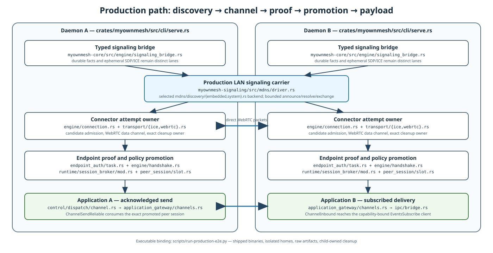
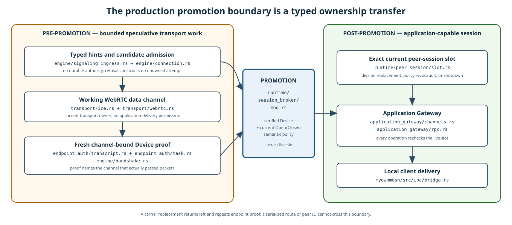
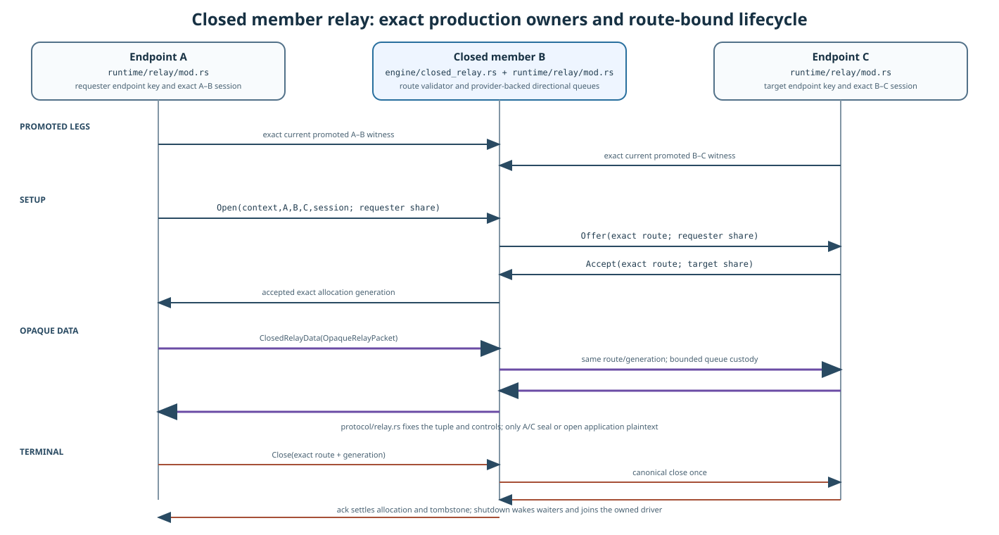

# MyOwnMesh application integration contract

Status: proposed application contract for the hybrid networking architecture.

This document defines the smallest interface between MyOwnMesh and a local application. It does not define application features, application authorization, or application workflow.

MyOwnMesh gives an ordinary application:

1. a derived roster view for one exact mesh context;
2. local reachability and session observations for exact Device IDs;
3. a live authenticated peer-session capability for one exact endpoint pair.

The application does not parse, construct, cache, reconcile, or route durable mesh facts. It does not construct transport-control signaling, select candidates or relays, perform NAT traversal, authenticate Device keys, or manage session recovery.



## 1. Responsibility contract

### 1.1 MyOwnMesh supplies

MyOwnMesh supplies:

- exact MeshContext and Device ID binding;
- Open or Closed durable participation semantics;
- durable fact construction, validation, storage, reconciliation, and compaction;
- typed signaling for durable facts and ephemeral transport control;
- candidate discovery, racing, connectivity checks, and transport recovery;
- direct, TURN, generic opaque relay, and eligible Closed member-relay connectors;
- bounded speculative pre-authentication work;
- fresh channel-bound endpoint authentication;
- exact session promotion and principal-bound live handles;
- current local reachability and transport diagnostics;
- bounded resource accounting, retry, cleanup, and error results.

### 1.2 The application supplies

The application supplies:

- the exact mesh-context handle and remote Device ID it wants to use;
- application feature and operation definitions;
- application capability grants;
- payload schemas and validation;
- codecs and media behavior;
- user-visible names, groups, and relationships;
- workflows, fanout, and application intermediaries;
- application queues, persistence, and delivery semantics;
- local service configuration for a headless consumer;
- user interaction.

An application may reject every operation from an authenticated peer. That decision does not change Open participation or Closed authorization.

## 2. What the application sees

### 2.1 Mesh roster view

```text
MeshRosterView {
    mesh_context,
    encoded_mesh_id,
    local_display_label_if_any,
    mesh_kind: Open | Closed,
    local_device_id,
    local_participation,
    view_status,
    participants: [
        MeshParticipant {
            device_id,
            participation_status
        }
    ]
}
```

For Open, the roster is the durable state derived from accepted unambiguous self-participation facts.

For Closed, the roster is the durable state derived from the locally accepted Closed governance proof.

`view_status` describes the local durable view. It does not claim global completeness or that no carrier is withholding a newer fact.

### 2.2 Reachability view

```text
PeerReachabilityView {
    mesh_context,
    device_id,
    durable_participation_or_authorization,
    signaling_observation,
    transport_observations,
    session_state,
    local_observation_ages
}
```

Suggested observation states are:

```text
SignalingObservation =
    ResponsiveParticipant
    | ResponsiveUnknown
    | Unknown

TransportObservationState =
    Gathering
    | Probing
    | Connected
    | Authenticating
    | Authenticated
    | Degraded
    | Failed

SessionState =
    Negotiating
    | Active
    | Suspended
    | Closed
```

These fields are distinct evidence. A signed presence response is not a working data channel. A connected channel is not yet an authenticated peer session. An expired observation does not mean withdrawal or removal.

Freshness uses local monotonic observation time. Remote timestamps and carrier timestamps are diagnostics only.

### 2.3 Authenticated peer-session handle

```text
AuthenticatedPeerSession {
    opaque_handle_capability,
    mesh_context,
    local_device_id,
    remote_device_id
}
```

The handle proves one exact endpoint relationship inside one exact context. It does not identify a route or intermediate relay as the peer.

The opaque capability internally binds:

- current endpoint-authenticated channel or channel set;
- exact local and remote Device IDs;
- exact MeshContext;
- authenticated local principal;
- current Open or Closed policy state;
- current resource reservation;
- one live runtime incarnation.

The ordinary application API does not expose a session generation, route generation, Path ID, or carrier class as authority.

### 2.4 Transport diagnostics

Transport diagnostics are separate from session identity:

```text
TransportDiagnostics {
    session_handle,
    active_connector_profiles,
    current_carrier_kinds,
    relay_device_ids_if_any,
    measured_latency_if_available,
    measured_loss_if_available,
    local_observed_at
}
```

These fields may change during recovery without changing the remote Device identity. They are non-authoritative and may become stale immediately.

## 3. Minimal ordinary API

```text
list_meshes()
    -> MeshSummary*

mesh_snapshot(mesh_context)
    -> MeshRosterView
    | UnknownMesh
    | MeshViewUnavailable

watch_mesh(mesh_context)
    -> bounded stream<MeshEvent>

peer_reachability(mesh_context, exact_remote_device_id)
    -> PeerReachabilityView

request_session(mesh_context, exact_remote_device_id)
    -> SessionOperation
    | UnknownMesh
    | LocalNotParticipating
    | RemoteParticipationUnknown
    | RemoteNotParticipating
    | RemoteNotAuthorized
    | ResourcePressure(resource_class)
    | ResourceUnavailable(resource_class)

watch_session(session_operation_or_handle)
    -> bounded stream<SessionEvent>

transport_diagnostics(authenticated_peer_session)
    -> TransportDiagnostics
    | StaleHandle

close_session(authenticated_peer_session)
    -> Closed
    | StaleHandle
```

`SessionOperation` is asynchronous. It may report candidate gathering and authentication progress without exposing raw candidates or route control.

### 3.1 Session data-plane capabilities

The basal application result is the live authenticated peer-session capability. Data-plane operations are a closed owner-selected capability set attached to that session. They may include reliable messages, byte streams, datagrams, or an optional connector-native real-time flow extension.

`MediaLane`, `Video`, `Audio`, H.264, Opus, screen share, camera, and microphone are not basal MyOwnMesh semantics. A WebRTC connector may expose native encoded real-time flows because RTP, RTCP, transceiver lifecycle, congestion behavior, and low-latency packet carriage are transport responsibilities. The application defines the codec and the meaning of each flow.

A conceptual optional interface is:

```text
open_realtime_flow(session_handle, application_flow_spec)
    -> RealtimeFlowHandle
    | UnsupportedDataPlane
    | ResourcePressure(resource_class)
    | ResourceUnavailable(resource_class)
    | StaleHandle

write_realtime_unit(realtime_flow_handle, application_encoded_unit)
read_realtime_units(realtime_flow_handle)
close_realtime_flow(realtime_flow_handle)
```

The exact API and operation set require owner selection. The ordinary application API does not receive RTP internals, SDP, m-line indexes, connector candidates, or a transport-wide lane number as authority.

Administrative APIs are separate and locally authenticated. They request semantic changes, while MyOwnMesh constructs and validates the exact durable facts.

## 4. Session establishment

### 4.1 Outbound request

```text
request_session(mesh_context, remote_device_id)
```

MyOwnMesh may perform these tasks concurrently:

1. validate the local principal;
2. inspect the current local Open or Closed durable state;
3. exchange typed connection intent and candidate control;
4. gather and race direct, TURN, generic relay, and eligible Closed member-relay candidates;
5. create bounded speculative transport state;
6. establish one or more working channels;
7. perform fresh endpoint authentication over each candidate channel that reaches that stage;
8. promote the first or preferred channel that satisfies every session guard.

The application supplies no address, candidate, route, relay, signaling record, or endpoint-authentication transcript.

### 4.2 Inbound attempt

An inbound hint or transport signal may cause bounded speculative candidate work before the remote Device identity or Closed authorization is fully known.

The application receives no inbound peer session until:

- the exact remote Device is authenticated over the working channel;
- the exact mesh context is bound;
- Open or Closed policy allows the peer;
- the local application principal is allowed;
- session resources and a live handle are reserved.

### 4.3 Promotion boundary



Before promotion, MyOwnMesh may gather candidates, open sockets, allocate bounded relay state, and perform bounded handshakes. It may not expose application payload or an authenticated peer-session handle.

This is the central application safety rule:

```text
working transport
    does not imply
AuthenticatedPeerSession
```

## 5. Open and Closed behavior

### 5.1 Open

Any authentic Device ID may self-participate in Open without sponsorship or pair permission.

Open participation permits MyOwnMesh to perform bounded negotiation and candidate work with authentic participants. Endpoint authentication remains mandatory. The application grants no feature merely because a mesh session exists.

Resource overload is reported as overload or unavailability, not as Closed-style authorization denial.

### 5.2 Closed

Closed adds current locally accepted governance authorization.

MyOwnMesh may perform bounded speculative transport work while Closed proof validation is in progress. It must not promote the channel or expose application data unless the selected Closed proof allows both endpoints.

A Closed unknown Device may be observed or probed under a bounded harmless-sighting rule where the selected profile permits it. That observation does not create Closed participation or session authority.

### 5.3 Application authorization begins after promotion

A promoted session proves the exact Device and MeshContext under the local accepted mesh view. It does not authorize application operations.

Applications exchange their own capabilities and feature negotiation over the authenticated session.

## 6. Recovery and handoff

MyOwnMesh owns transport recovery. The application does not select a new relay or route.

A live session may have one or more authenticated channels. When the active carrier degrades or fails, MyOwnMesh may:

1. keep any usable authenticated channel active;
2. gather and race replacement candidates;
3. authenticate a replacement channel;
4. add it to the live session;
5. change local outbound selection;
6. retire or retain old channels.

No persistent path ledger or monotonic session generation is required.

The session handle may remain stable across a successful internal handoff. A profile may instead issue a replacement handle when required by its cryptographic or process boundary. In either case, an old public identifier alone cannot authorize use.

An attacker may force a carrier failure and thereby trigger recovery. The attacker cannot make an unauthenticated replacement channel usable.

If no authenticated channel is usable, the session becomes `Suspended`. Payload operations fail or wait according to the selected application API. Recovery returns it to `Active` only after a valid authenticated channel exists.

## 7. Carriers and relay behavior

### 7.1 Direct and TURN

Direct and TURN-carried sessions expose the same remote Device ID and application semantics.

TURN is a packet carrier. It may observe addresses, packet sizes, timing, and the metadata required by its function. It cannot become the endpoint or application authority under the endpoint cryptographic premises.

### 7.2 Generic opaque relay

A generic relay carries opaque endpoint packets for one exact endpoint pair. It has finite allocation, buffer, retry, and bandwidth limits and no application-recipient fanout.

### 7.3 Closed member relay

A currently authorized Closed member B may provide a bounded member-relay carrier when the selected Closed profile and local policies allow it.

The application-visible endpoint relationship remains:

```text
AuthenticatedPeerSession(A, C)
    carried through visible relay B
```

B is not anonymous. B may deny or degrade availability and observe metadata, but cannot read or author accepted A-C application plaintext under the endpoint cryptographic premises.

A Closed member relay may be attempted immediately, raced with other carriers, or retained as backup. The application does not decide when it is used.



### 7.4 Explicit application intermediary

An application intermediary is a separate construction:

```text
AuthenticatedPeerSession(A, B)
    -> B application processing
    -> AuthenticatedPeerSession(B, C)
```

B is then an application endpoint and may see plaintext according to application policy. MyOwnMesh does not disguise this as a transparent relay.

## 8. Durable semantic and signaling boundary

The durable semantic store is internal to MyOwnMesh. The ordinary application API does not expose:

- raw durable facts;
- Fact IDs as application data identifiers;
- causal parents or compacted bases;
- cache insertion or eviction controls;
- governance proof formats;
- raw ephemeral transport-control messages;
- SDP, ICE candidates, STUN or TURN credentials;
- relay allocation tokens;
- signaling retry controls.

The application cannot put payload into signaling because it has no generic signaling constructor or publisher.

## 9. Devices in multiple meshes

Every roster view, observation, request, session, and handle names one exact mesh context.

The same Device ID in two contexts is two distinct peer contexts:

```text
PeerContext = (
    mesh_context_digest,
    local_device_id,
    remote_device_id
)
```

A state change in one mesh does not mutate the other.

## 10. Application-owned workflows

### 10.1 Local fanout

To send to B and C, an application requests independent sessions and application operations. Failure to reach B does not route B's operation through C.

### 10.2 Coordinated workflow

An application may use a result from B before sending a separate operation to C. MyOwnMesh supplies the exact sessions; the application owns the dependency.

### 10.3 Store and forward

Store-and-forward is an application service, not implicit mesh packet routing. It must define its own destination, provenance, expiration, duplicate, loop, persistence, and authorization semantics.

## 11. Headless consumer

A headless consumer receives an authenticated peer-session capability and exposes only locally configured services:

```text
ServiceCatalog {
    opaque_service_id
        -> fixed_local_connector
        -> application_capability_rule
}
```

The remote peer cannot provide an arbitrary local host, port, path, command, URL, or device target.

The headless consumer owns application payload parsing, capability checks, queues, persistence, and local service access.

## 12. Deployment forms

### 12.1 In-process runtime

The application links MyOwnMesh and receives capabilities in the same process. Device-key custody and runtime integrity are inside that process boundary.

### 12.2 Shared MyOwnMesh process

A shared process owns durable state, signaling, connectors, endpoint authentication, and sessions. Local applications use authenticated IPC capabilities.

A socket name, process name, numeric client ID, or request ID is not authority.

### 12.3 Separate headless consumer

A generic or product-specific consumer receives authenticated sessions and exposes application services without moving product semantics into MyOwnMesh.

## 13. Status and failure semantics

### 13.1 Durable view status

```text
MeshViewStatus =
    Ready
    | Reconciling
    | KnownIncomplete
    | Unavailable
```

`Ready` means internally valid under the accepted local durable basis. It does not prove global completeness.

### 13.2 Session state

```text
SessionState =
    Negotiating
    | Active
    | Suspended
    | Closed
```

### 13.3 Session failures

```text
SessionFailure =
    UnknownMesh
    | LocalNotParticipating
    | RemoteParticipationUnknown
    | RemoteNotParticipating
    | RemoteNotAuthorized
    | MeshViewUnavailable
    | NoSignalingPath
    | NoViablePeerTransport
    | EndpointAuthenticationFailed
    | ResourcePressure(resource_class)
    | ResourceUnavailable(resource_class)
    | StaleHandle
    | SessionClosed
```

`NoSignalingPath` and `NoViablePeerTransport` remain distinct. Signaling success does not prove a data path.

## 14. Resource ownership

MyOwnMesh owns leases and pressure behavior for:

- durable fact validation and storage;
- signaling connections, frames, queues, and provenance;
- candidate gathering and transport attempts;
- sockets, timers, tasks, and callbacks;
- TURN and relay allocations;
- pre-authentication packet and media quarantine;
- endpoint authentication;
- authenticated sessions and transport recovery;
- principal-bound handles and diagnostic streams.

The application owns:

- payload parsing and validation;
- codecs and media buffers after promotion;
- application features and capabilities;
- application queues, persistence, retries, and fanout;
- user-visible history and workflow.

The component that allocates or retains a protected resource acquires its finite lease before allocation or retention. Basal MyOwnMesh does not expose or require a fixed maximum number of Mesh runtimes, peers, attempts, sessions, or flows. A request succeeds while the process resource provider grants its exact claim. Otherwise the application receives typed pressure or unavailability.

The application does not choose low-level connector counters, resource weights, quotas, or shares. One finite process grant is shared by all Mesh scopes, and unused capacity is borrowable. Adding scopes cannot multiply that grant.

The basal application-visible contract is a set of properties, not a scheduling algorithm:

- **Conservation.** Live claims never exceed the process grant. No admission path mints capacity.
- **Cleanup ownership.** Only the exact owner releases a claim, and only after its own cleanup. The provider may request retirement of a lease whose owner contract declares it reclaimable, but a request releases nothing.
- **Honest retention.** An owner whose cleanup cannot be proven transfers the exact charge into failed-cleanup retention rather than dropping it silently.
- **Fallible admission.** There is no guarantee of eventual admission. A nonreclaimable lease, an ignored retirement request, or a retained failed-cleanup charge may hold capacity indefinitely.
- **Pressure is not authorization.** The application receives typed pressure or unavailability, never an Open or Closed authorization result, when resources are short.
- **Time is not resource truth.** No timer expires a pending demand, completes a retirement, or releases a claim. Elapsed time alone never changes what is charged.
- **Optional isolation.** A deployment may install a stricter local ceiling or isolation policy for a locked-down appliance, Closed deployment, carrier cost boundary, or product requirement. Such policy is explicitly optional, and it cannot create resources or mesh authority.
- **Repartition non-amplification.** Scheduling attributes each demand to a FairnessRoot: a trusted local process or ingress scheduling attribution, assigned by the local process and never minted, named, split, or multiplied by the claimant it attributes. A FairnessRoot is not a Device ID, Mesh Context, durable identity, endpoint identity, authentication or authorization root or capability, or any wire-visible value, and it carries no authority. An AttributionChildScope is an accounting subdivision beneath exactly one FairnessRoot. The requirement is stated over a finite trace with a fixed set of roots: repartitioning one FairnessRoot's demands across additional AttributionChildScopes beneath that same root, changing nothing else, must not make that root eligible earlier, give it more selections or turns, increase its admitted quantity, or delay a competing root. The requirement bounds amplification only. It does not require that the repartitioned root fare no worse, or that a competing root fare no better, so equality of outcome is neither required nor implied.
- **Immediate pressure only for a claim that does not fit.** Immediate pressure is returned only when the exact claim does not fit the remaining grant. A claim that fits is admitted, unless one of the following holds and is stated: a proven structural limit forbids it; an explicit isolation policy or optional local ceiling refuses it; or the accounting needed to prove the admission safe is unavailable, poisoned, or cannot be proven safe. Absent one of those, a fitting claim is not refused. Undeclared reluctance is not a reason: the provider may not refuse a fitting claim merely because it is busy, because product policy prefers to hold capacity back, or because it is unwilling. Uncertainty about whether the admission is *safe* is different and is the third stated exception — where the accounting needed to prove safety is unavailable, poisoned, or cannot be proven safe, refusal is correct and must be reported as that condition rather than as ordinary pressure.
- **Safe committed-grant contraction.** A deployment may reduce the committed grant, but the committed grant is never installed or reduced below what is already charged — the sum of live claims and failed-cleanup-retained charges. Charged claims therefore never exceed the committed grant, and no contraction creates a moment in which conservation appears to fail. A contraction releases, revokes, invalidates, and reuses nothing, never forges a release, and never admits a conflicting claim to make room; it may request retirement only from the exact owners whose lease contract declares those leases reclaimable, and such a request still releases nothing. When the host capacity a deployment observes or wants falls below what is already charged, the provider reports a typed degraded or overcommitted state *relative to that host capacity*, while continuing to hold the committed grant and every unreleased charge; it admits no conflicting new work in the affected dimension and refuses it with typed pressure naming that dimension. The committed grant moves toward the smaller target only as owner-driven releases reduce current charges enough to make each step safe. A contraction is not equivalent to an instantaneous probe of current use, and neither may be substituted for the other.

How a provider orders and services demands under pressure is provider policy, not a basal mesh semantic. A provider may adopt a particular pending-demand cardinality, an authority ordering over demand classes, and a rotation rule among equal-class scopes; a different conforming provider may schedule differently. Applications must depend on the properties above, not on any particular selection rule, and no application-visible type encodes one.

Which local values a deployment maps onto a FairnessRoot is trusted local deployment policy — an OS user, a local service account, an authenticated IPC peer, or a named local ingress are all admissible choices. This contract fixes no root taxonomy and requires none.

The mapping is performed by a trusted local verifier, and it may legitimately take verified facts as inputs: an authenticated local principal, a verified ingress classification, or another locally established fact may all inform which root a demand is attributed to. What the contract forbids is claimant control over the root structure. No claimant-supplied or wire-visible value may directly name, select, split, or multiply a FairnessRoot, and no party may increase the number of roots it is attributed to by asserting something. The mapping need not be independent of the existence of verified facts; it must be independent of unverified assertion.

Repartition non-amplification is a statement about attribution beneath one FairnessRoot over a finite trace. It is not a claim about real-world identity. It does not assert that a real adversary is confined to one FairnessRoot, that distinct roots correspond to distinct people, organizations, or devices, or that an adversary able to obtain several genuine roots is thereby limited. Sybil resistance, admission of new principals, and ingress identity are separate problems that this property does not address and must never be cited to support.

Progress under hostile ingress is a separate contract. Repartition non-amplification says nothing about whether a hostile or misbehaving ingress can delay or starve other work. Hostile-ingress behavior is governed by the separate ingress progress and backpressure contract: bounded pre-authentication work, typed backpressure to the producer, and refusal that names an unavailable resource dimension. An application must not cite repartition non-amplification as evidence of hostile-ingress progress, and must not cite hostile-ingress backpressure as evidence of repartition non-amplification.

Provider determinism is narrow. Two evaluations are guaranteed to agree only when they use identical already-issued scope identities, start from identical provider state, and apply the same operations in the same order. Nothing guarantees that identities issued in a fresh run match those of a previous run, or that admission order is reproducible across processes, allocators, or schedules. An application must not depend on cross-run reproducibility.

Whether any particular provider satisfies the properties above, including the provider shipped with basal MyOwnMesh, is recorded in [`IMPLEMENTATION-CONSTRAINTS-AND-INVARIANTS.md`](IMPLEMENTATION-CONSTRAINTS-AND-INVARIANTS.md) and not here. Silence in this document is not a conformance claim.

Reliable streams, interactive real-time flows, delayed satellite delivery, and storage-backed transport do not share one queue rule. Each uses the pressure contract appropriate to its provider. Every retained unit still owns storage and scheduled-work leases. Time passage alone does not expire a slow operation or release its resources.

## 15. Acceptance gates

The application integration passes only when:

- every application object names one exact mesh context;
- Open permits authentic self-participation without sponsorship;
- Closed promotion requires the selected current authorization proof;
- raw durable facts and ephemeral signaling constructors are absent from the ordinary API;
- applications cannot inject candidates, routes, relays, or endpoint-authentication transcripts;
- bounded speculative transport may occur before endpoint admission;
- no application payload is sent or delivered before channel promotion;
- a working socket alone never becomes a peer session;
- every session proves the exact remote Device on the exact channel;
- direct, TURN, generic relay, and Closed member relay preserve the same endpoint identity;
- carrier diagnostics are separate from peer identity and application authorization;
- recovery does not require a persistent path ledger or monotonic session generation;
- stale or foreign-principal handles fail before payload use;
- signaling never becomes a generic application-data bus;
- explicit application intermediaries remain explicit endpoints;
- every protected queue entry, candidate, transport, relay, and session object holds a live finite lease;
- another object is admitted whenever the provider grants its exact claim, without a basal product-count ceiling;
- resource refusal identifies pressure or unavailability, never Open or Closed authorization;
- Mesh scopes share one process grant and cannot multiply capacity;
- no basal weights, quotas, reserved shares, or partitions exist;
- no basal pending-demand ordering, rotation rule, or per-scope demand cardinality is required, and no application-visible type encodes one;
- the selected provider documents its own demand-selection policy and shows that the policy alone mints no capacity;
- repartition non-amplification holds over a finite trace with a fixed root set: repartitioning one FairnessRoot's demands across additional AttributionChildScopes beneath that same root does not make that root eligible earlier, give it more selections or turns, increase its admitted quantity, or delay a competing root. The gate is asserted as those four comparisons, requires no equality of outcome in either direction, and must not be reworded into a per-scope guarantee;
- the FairnessRoot mapping is performed by trusted local verification, which may use verified local facts such as an authenticated principal as inputs, while no claimant-supplied, peer-supplied, or wire-visible value can directly name, select, split, or multiply a root, and no unverified assertion increases the roots a party is attributed to;
- repartition non-amplification is never cited as a real-world identity, claimant-count, or Sybil-resistance claim, and hostile-ingress progress is asserted separately under the ingress progress and backpressure contract;
- immediate pressure is returned only for a claim that does not fit, and a claim that fits is admitted unless a proven structural limit, an explicit isolation or optional ceiling policy, or unavailable, poisoned, or unprovable-safe accounting is stated;
- a committed grant is never installed or reduced below the sum of live plus failed-cleanup-retained charges, so charged claims never exceed the committed grant at any instant;
- where observed or desired host capacity falls below current charges, the provider reports a typed degraded or overcommitted state relative to that host capacity while retaining the committed grant and every unreleased charge, admits no conflicting new work in the affected dimension, requests retirement only from exact owners whose contract declares those leases reclaimable, and reduces the committed grant only as owner-driven releases make each step safe;
- grant contraction is never reported as, or substituted for, an instantaneous probe of current use;
- provider determinism is claimed only across identical already-issued scope identities, identical provider state, and the same ordered operations;
- only owners of leases their contract declares reclaimable receive retirement requests;
- a retirement request does not release its claim;
- owner Drop or explicit failed-cleanup retention preserves exact release accounting;
- admission is not guaranteed against nonreclaimable pressure, ignored retirement, or failed cleanup;
- elapsed time alone expires no demand, retirement, or claim;
- optional local ceilings and isolation policies remain explicit, optional deployment policy.

## 16. Owner decisions

The owner must select:

1. the application data-operation set;
2. local-principal authentication for each platform;
3. whether applications share peer sessions;
4. key custody for in-process and shared-process deployments;
5. connector and carrier profiles;
6. Closed member-relay policy;
7. session recovery and multi-channel behavior;
8. diagnostic detail;
9. headless consumer connector types;
10. the resource provider for each deployment form, reported as a provider and host-isolation integration description — its declared demand-selection policy, its residual and isolation boundaries, and the evidence that it satisfies the properties in section 14 — rather than a table of fixed numeric limits, weights, or product counts;
11. any optional local ceilings, cost policies, or isolation requirements, each recorded as explicitly optional deployment policy;
12. acceptance or isolation of native WebRTC, allocator, runtime, kernel, driver, and external-provider residuals;
13. measurements used for performance, cost, scheduling, regression, and opaque-resource characterization.
