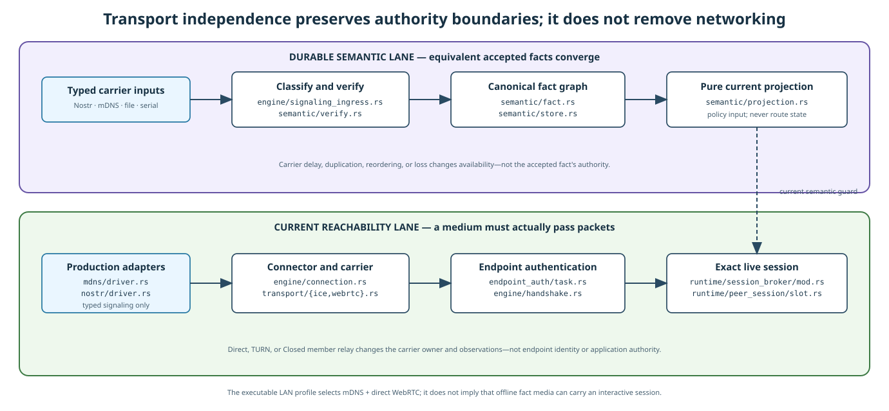

# MyOwnMesh fundamental hybrid networking architecture

Status: owner-adopted V4 architecture, as amended by owner review.

This document defines the smallest common architecture for MyOwnMesh discovery, durable mesh semantics, signaling, transport path construction, endpoint authentication, session recovery, and application data delivery.

MyOwnMesh is a **transport-independent hybrid networking system**. Transport independence means that a durable fact does not gain or lose authority because of the medium that carried it. It does not mean that transport is optional, external to the system, or operationally interchangeable. Discovery, signaling, candidate gathering, connectivity checks, relay allocation, congestion behavior, packet carriage, recovery, and reachability remain first-class parts of MyOwnMesh.

The mathematical model is in [`FORMAL-PROOFS.md`](FORMAL-PROOFS.md). Concrete constraints and invariants are in [`IMPLEMENTATION-CONSTRAINTS-AND-INVARIANTS.md`](IMPLEMENTATION-CONSTRAINTS-AND-INVARIANTS.md). The application boundary is in [`APPLICATION-INTEGRATION.md`](APPLICATION-INTEGRATION.md).
The existing-repository migration is governed by [`TRANSITION-PLAYBOOK.md`](TRANSITION-PLAYBOOK.md) and [`ARCHITECTURE-OWNERSHIP.md`](ARCHITECTURE-OWNERSHIP.md).

## 1. Canonical end-to-end architecture


The architecture has five cooperating mechanisms:

1. **Durable semantic state** stores and derives long-lived mesh meaning, such as Open participation, Closed governance, durable capability grants, and optional application contract facts.
2. **Signaling** moves durable facts and ephemeral transport-control messages through any suitable signaling medium.
3. **The connector runtime** performs actual networking work: discovery, candidate gathering, candidate racing, connectivity checks, relay allocation, transport handshakes, measurement, migration, and recovery.
4. **Endpoint authentication and the session broker** promote a working channel into an application-usable peer session only after exact Device authentication and current mesh policy checks.
5. **Applications** exchange payload only through a live authenticated session capability.

The causal sequence is:

```text
Durable semantic state and typed signaling
        -> bounded connector work
        -> a channel that actually passes packets
        -> fresh endpoint authentication over that channel
        -> Open or Closed policy and local-principal checks
        -> live AuthenticatedPeerSession
        -> application payload
```

No route must become a durable ledger object before the connector may try it.

## 2. Transport independence, not transport removal



For durable semantic facts, equivalent accepted inputs produce equivalent durable state regardless of whether the bytes arrived through Nostr, mDNS, WebSocket, a signaling cache, a file, serial transport, shared storage, removable media, an optical encoding, or another suitable medium.

Formally, if two deliveries produce the same accepted durable fact set under the same context, domain rules, and verified basis, they produce the same durable derived state.

This guarantee does not claim that all media can perform every networking operation. A removable drive can convey a governance fact but cannot provide an interactive endpoint channel. A UDP path can carry real-time packets but may require additional machinery for reliable semantic exchange. Each operation uses a medium or connector profile capable of the liveness, directionality, ordering, latency, and packet behavior that operation requires.

Transport properties affect:

- availability and latency;
- NAT and firewall traversal;
- congestion and loss behavior;
- packet size and fragmentation;
- addressability and multicast capability;
- relay and migration support;
- metadata exposure;
- cost, power, and resource use.

They do not, by themselves, establish Device identity, Open participation, Closed authorization, or application authority.

## 3. Durable semantic state

The durable semantic subsystem stores only facts whose meaning must survive transport loss, process restart, reordering, duplication, and delayed delivery.

The core durable fact families are:

```text
DurableFact =
    OpenParticipation
    | ClosedGovernance
    | DurableCapabilityGrant
    | DurableCapabilityRevocation
    | OptionalApplicationContractFact
```

A concrete profile may define a smaller closed set. New fact families require an adopted typed domain definition. There is no arbitrary opaque fact body in the core.

Every durable fact has:

- one canonical encoding;
- one content-derived identifier;
- an exact author and signature;
- one exact mesh or contract context;
- exact causal dependencies where required;
- domain-defined conflict and projection rules;
- bounded shape and verification cost.

Durable state is derived by a pure function:

```text
Project(
    mesh_context,
    projection_scope,
    verified_basis,
    accepted_durable_facts
) -> DerivedDurableState
```

In this specification, **projection means deterministic semantic derivation**. It is not forecasting, route construction, topology advertisement, physical reachability, or a networking operation.

`Project` may derive:

- the local Open roster view;
- the local Closed authorization view;
- durable capability state;
- explicit ambiguity in an exclusive durable semantic cell;
- optional application contract state.

It does not derive a live route, a working socket, a current relay allocation, a congestion state, or an `Online` boolean.

### 3.1 Open

Open is permissionless self-participation.

```text
Valid self-authored OpenParticipation(Present)
    -> the author may project as an Open participant
```

No sponsor, founder, quorum, pair grant, signaling service, application, identity-count vote, proof of work, or existing participant approves the Device ID.

Resource pressure may refuse or evict local work. That is a typed resource or availability result, not an authorization denial.

### 3.2 Closed

Closed adds the exact authorization proof selected by the Closed mesh context. Closed may be fully locked down.

The Closed governance commitment may describe a threshold rule, delegation graph, multisignature policy, causal governance rule, or another reviewed decentralized proof system. It does not inherently identify a central server or online authority.

A Closed operation has authority only when the locally accepted Closed governance state proves it. A valid Device signature alone is not Closed admission.

### 3.3 Causality and conflict

Durable causality is a partial order. Two facts may be causally unrelated. Causal concurrency is not itself a conflict.

Each adopted fact domain separately classifies relevant concurrent facts as:

- **Independent**, when they affect different semantic cells.
- **Joinable**, when the domain defines an associative, commutative, and idempotent join.
- **Exclusive**, when incomparable facts compete for one singular semantic cell.

Only exclusive same-cell competitors are a no-go for singular authority. They remain explicit and fail closed until the domain-defined resolution cites the required heads.

### 3.4 Retention and compaction

The durable store need not retain complete history. It may replace resolved history with a verified, independently reopenable semantic basis that preserves:

- current durable state;
- unresolved exclusive conflicts;
- exact continuation validation required by the adopted domain;
- evidence still required by live guards or pending durable effects.

Facts continue to reference facts. A compaction base is verification evidence, not an author or causal event.

Opening stored durable state never recreates live sockets, channels, keys, reachability observations, connector objects, session handles, or resource reservations from a prior runtime.

## 4. Typed signaling

Signaling is a first-class networking mechanism. It is not merely file movement, and it is not the application data path.

Signaling carries two disjoint categories:

```text
Durable semantic exchange:
    durable signed facts
    inventories and exact dependency requests
    compacted-basis proofs where adopted

Ephemeral transport control:
    connect intent
    offers and answers
    candidates and candidate updates
    relay requests and relay responses
    cancellation and recovery hints
```

Ephemeral transport control is typed, bounded, context-associated where known, and unavailable to ordinary application payload APIs. It is not required to be content-addressed, retained forever, compacted, or projected as durable state.

A signaling message may be authenticated early, late, or not at all depending on its type and connector profile. Lack of early authentication limits the effect to bounded speculative work. It cannot create durable authority or an application session.

Signaling carriers may cache, delay, duplicate, reorder, censor, or reveal control information. Those behaviors affect availability and metadata exposure. They do not replace durable fact validation or endpoint authentication.

## 5. Connector runtime and speculative transport work

The connector owns pathfinding and packet transport. It may start useful work before endpoint identity and Closed authorization are fully proven.


An untrusted hint or partially authenticated signal may create only lease-backed speculative state, such as:

```text
ConnectorCandidateCapability
TransportHandle
RelayAllocationToken
ConnectedChannelCapability
TransportObservation
```

The connector may:

- gather local and remote candidates;
- probe addresses;
- open or accept sockets;
- allocate bounded TURN or member-relay state;
- race candidates;
- perform a transport handshake;
- measure whether packets pass;
- detect failure and clean up.

Those actions are real networking work. Preventing them until the full semantic proof completes would make the network slower and less usable without strengthening endpoint identity.

Before promotion, speculative work may not:

- mutate Open or Closed durable authority;
- expose an authenticated peer-session handle;
- deliver application payload to a consumer;
- send application payload as an authenticated peer;
- select arbitrary relay destinations;
- retain protected state or schedule protected work without a live resource lease.

MyOwnMesh does not maintain a parallel global route table. A connector may keep local ephemeral candidate and channel indexes for operation and diagnostics. Those local identifiers are not ledger facts, peer identity, application authority, or cross-runtime route identifiers.

### 5.1 Attempt, connector, and resource cardinality

One connection attempt is a cancellation, race, and aggregate-resource owner. It may own several connector candidates. One WebRTC connector candidate owns exactly one `RTCPeerConnection` and its one ICE agent. That ICE agent may gather, receive, and check many internal ICE candidates and candidate pairs.

These relationships describe ownership, not product-wide maximum counts. Basal MyOwnMesh defines no fixed semantic ceiling for Mesh runtimes, peers, attempts, sessions, or real-time flows. A finite host still has finite resources, so creating any of these objects is fallible. Admission succeeds only when the applicable resource provider grants the object's finite composite claim. Refusal is typed resource pressure or unavailability, never an Open or Closed authorization result.

```text
host or process resource provider
    -> grants finite ResourceLease for an exact ResourceClaim
    -> process resource root
        -> Mesh resource scope
            -> attempt, candidate, callback, cleanup, and flow owners

sum of live and failed-cleanup-retained claims in each resource dimension
    <= resource grant currently assigned to the process
```

Mesh scopes attribute use to one finite process grant. Creating another Mesh scope does not create capacity.

Basal MyOwnMesh constrains the finite provider by property, not by algorithm. Any conforming provider must preserve:

```text
P1 Domain conservation
    the sum of live and failed-cleanup-retained claims in each resource
    dimension never exceeds the grant actually assigned to the process;
    a claim never exceeds the provider domain it is drawn from

P2 Cleanup ownership
    only the exact owner releases a claim, and only after cleanup; no
    provider, peer, message, or timer can forge a release, and resources
    a cleanup path requires stay retained until that cleanup completes

P3 No minting
    no scope, child scope, or identity creates capacity

P4 Work conservation
    capacity that is neither live nor reserved for an in-flight
    admission is borrowable by any scope that can use it. A provider
    may return immediate typed pressure instead of retaining a demand
    only when the claim does not currently fit. A claim that does fit
    is admitted, unless the refusal is justified by a proven structural
    limit of the provider, by an explicit isolation policy or optional
    local ceiling under P5, or by accounting that is unavailable,
    poisoned, or otherwise unable to prove the admission safe. Every
    such reason is declared. Arbitrary refusal is prohibited and can
    never stand as a hidden limit

P5 Explicit isolation
    every partition, reserved share, or isolation ceiling is explicit
    local policy, never a basal guarantee

P6 Partition invariance of scheduling
    one-way non-amplification. Repartitioning one fixed fairness root's
    identical demand trace across more attribution child scopes beneath
    it must not give that root earlier eligibility, additional
    selections or turns, or a larger admitted quantity, and must not
    delay a competing fixed root. It requires no equality of outcome
    and constrains nothing else. Stated precisely below

P7 Pressure is not authorization
    refusal, pressure, and unavailability are typed resource results,
    never an Open or Closed authorization outcome in either direction

P8 Time is not resource truth
    elapsed duration alone creates, releases, expires, and validates
    nothing
```

P6 is stated over fairness roots and attribution child scopes. Both are closed architectural definitions:

```text
FairnessRoot
    the unit of scheduling attribution that a provider serves
    selected locally by the trusted provider or ingress owner that
        installs the grant
    process-local and opaque: it has meaning only within one process's
        scheduling. The root value itself is never transmitted and never
        compared across processes
    not mintable by the claimant it attributes: no unverified claimant,
        peer, or wire assertion may directly name, select, split,
        rotate, or multiply a FairnessRoot
    mapped from locally trusted input: the trusted provider or ingress
        owner may use facts it has itself verified or authenticated,
        including an authenticated local principal or an isolated
        ingress domain, as input to the mapping. Mere submission over
        the wire is never sufficient; local verification is what makes
        an input usable
    not a semantic or durable identity, and not an authentication or
        authorization root or capability: it is not a Device ID, Mesh
        ID, durable semantic identity, endpoint identity, or wire value,
        and holding one grants nothing. It may be a local scheduling
        identity within its own process

AttributionChildScope
    an accounting and attribution refinement beneath exactly one
        FairnessRoot
    may divide, label, and measure use within that root
    creates no additional share, turn, or service weight: the
        scheduling share of a FairnessRoot does not change with the
        number of attribution child scopes beneath it
```

**P6 stated precisely, as finite-trace partition invariance.** Consider two fairness roots, `A` and `B`. Hold all of the following fixed:

```text
the two fairness roots
one finite ordered demand trace for each root
    each demand's exact resource claim
    each demand's authority class
    each demand's reclaimability under its owner contract
    the arrival event and ordering of every demand
    the release event and ordering of every completed demand
the initial provider state and the grant
```

Now take root `A`'s trace and repartition it across any number of attribution child scopes beneath `A`. The repartitioning changes only how the same demands are attributed. It does not change what any demand asks for, its authority, its reclaimability, or when it arrives or releases.

P6 is a one-way non-amplification requirement. It requires that for every such repartitioning of that identical trace:

```text
no earlier eligibility
    no demand of A becomes eligible for selection sooner than it was in
    the unpartitioned trace
no additional selections or turns
    A receives no more selection opportunities, turns, or service
    events than in the unpartitioned trace
no larger admitted quantity
    A is admitted no greater quantity in any resource dimension than in
    the unpartitioned trace
no delay imposed on the competing root
    no demand of B becomes eligible later or is selected later than in
    the unpartitioned trace, where a demand that is not selected at all
    counts as selected at an unbounded position
```

These four comparisons are the whole of P6, and each bounds one direction only. P6 does not require that service outcomes be identical. It does not forbid the repartitioned root from faring worse, and it does not forbid the competing root from faring better. It bounds only amplification of the repartitioned root and delay of the competitor.

Delay of the competitor covers both when its demands become eligible and where its selections fall in the selection order, because a demand can remain eligible at the same moment and still be selected later. Selection position uses the convention that a demand which is not selected at all sits at an unbounded position. A selection the competitor held in the unpartitioned trace and loses under repartitioning has therefore moved from a finite position to an unbounded one: it has been delayed without bound, and the same delay bound excludes it. No separate rule about how many of the competitor's demands are selected is needed or implied.

Additional selections for the competitor remain permitted, since a demand it did not hold in the unpartitioned trace is outside the comparison. How much the competitor is admitted remains unconstrained in either direction.

Repartitioning may therefore change how charges are labelled, measured, and reported. What it may not do is win the repartitioned root earlier eligibility, extra turns, or a larger admitted quantity, or push the competitor later.

**What P6 does not claim.** P6 is an invariance property over attribution. It is not an identity property over the world, and it is deliberately silent about who a claimant really is.

```text
P6 does not bind apparent ingress sources into one real-world claimant
P6 is not a proof of Sybil resistance
P6 does not decide how many fairness roots an actor should receive
```

If a provider maps two apparent sources to two fairness roots, P6 says nothing about whether those sources are one actor. It constrains only what re-attribution beneath an already-selected root can achieve.

Selecting roots is a local trust decision that sits outside P6. A trusted local provider or ingress owner may derive fairness roots from facts it has itself verified or authenticated, including an authenticated local principal or an isolated ingress domain. What is prohibited is unverified influence: no unverified claimant, peer, or wire assertion may directly name, select, split, rotate, or multiply a fairness root. Mere submission over the wire is never sufficient to move a partition; a locally verified or authenticated input is a permitted mapping input.

**P6 is not a progress property.** P6 says nothing about progress, throughput, latency, or backpressure, and nothing about behavior under hostile ingress. Whether a system keeps making progress while an adversary floods ingress is a separate concern, addressed by ingress admission, authentication placement, and backpressure design. Satisfying P6 neither implies nor requires progress under hostile ingress, and no liveness claim follows from P6.

Selection order, rotation rule, and pending-demand cardinality are concrete provider policy, not basal architecture. A resource-provider implementation chooses them and may replace them with any policy that preserves P1 through P8. No other subsystem may depend on a particular choice.

This architecture selects no scheduler, no fairness-root taxonomy, no weights or quotas, and no mapping from fairness roots to service turns. It requires only that whatever a provider selects, subdividing attribution beneath a fixed fairness root cannot give that root earlier eligibility, additional selections or turns, or a larger admitted quantity, and cannot delay a competing fixed root.

A conforming provider satisfies P1 through P8. Whether any particular provider does so is recorded in the implementation and transition documents, not here.

Under any such policy, when a selected demand cannot fit, the provider may request retirement from an exact owner whose lease contract declares that lease reclaimable. Which leases are reclaimable is part of the owner contract, not a provider decision. That request is sticky and contains no timer. It does not release, revoke, or alter a claim. The notified owner must finish cleanup and drop its lease, or explicitly transfer the unreleased claim into failed-cleanup retention when cleanup cannot be proven.

**Committed grant and external capacity change.** The grant is not required to be constant, but three quantities must never be conflated:

```text
H   external observed or desired host capacity
        what the host, operating system, container, or embedding owner
        currently reports, offers, or wishes to allow

Gc  committed grant
        what the provider has actually committed to this process, and
        against which every live claim was admitted

S   charged sum
        live claims plus failed-cleanup-retained claims
```

`S <= Gc` holds at all times. A provider may raise `Gc`, and it may lower `Gc`, but it may never lower `Gc` below `S`. A committed grant reduced below what is already charged would have to either forge a release, which P2 forbids, or leave a charge unattributed, which P1 forbids. Neither is available, so `S > Gc` is unreachable.

Two different conditions share the word overcommitment and must not be confused:

```text
external overcommitment, relative to H
    H < S: the host currently offers or desires less than is already
    charged. This is a real condition, it is required to be reported as
    a typed degraded or overcommitted state relative to H, and it is
    reachable at any time because H is outside the provider's control

internal overcommitment, S > Gc
    charges exceeding the committed grant. This is unreachable. It
    would require a forged release or an unattributed charge, and no
    conforming provider can enter it
```

When `H` falls below `S`, the provider reports a typed degraded or overcommitted state relative to `H`, while `S <= Gc` remains invariant. It behaves as follows:

```text
Gc stays at or above S
    the committed grant is never reduced below the charged sum. It
    contracts only as owner-driven release lowers S, and only as far as
    the current S. Contraction trails release; it never causes it

typed degraded or overcommitted reporting
    the provider reports a typed degraded or overcommitted state
    relative to H. Reporting it is required, not optional. The report
    names H. It never presents a reduced Gc, never describes S as
    exceeding Gc, and never claims capacity was taken back

no new conflicting work
    admission of work that would conflict with the external constraint
    is refused with typed pressure or unavailability

retirement requests only
    the provider may request retirement from exact owners whose
    contracts declare their leases reclaimable, exactly as elsewhere.
    It releases nothing itself and compels nothing

all unreleased charges retained
    every live and failed-cleanup-retained charge stays charged and
    exactly attributed. Nothing is written off to close the gap

H is never Gc
    an observed or desired host capacity is never presented as the
    committed grant and never silently becomes one
```

External capacity loss is therefore an observation and a constraint on future admission, never a reduction of what is already committed. Conservation is never suspended and is never momentarily false. A deployment that must be able to honor a fall in `H` immediately reserves or isolates in advance under P5; it cannot obtain that guarantee afterwards by revoking.

No cooperative mechanism guarantees admission. Capacity held by nonreclaimable admitted work, an ignored retirement request, and failed-cleanup retention can each prevent admission indefinitely. Optional local policy may impose stricter cardinality or isolation ceilings for a locked-down appliance, Closed deployment, carrier cost boundary, or test. That wrapper is explicitly optional, is never required for ordinary construction, and is not basal mesh semantics.

Resource limits have four distinct sources:

```text
Protocol-shape bound
    canonical parser or wire validity

Provider structural limit
    actual transport, codec, kernel, or hardware constraint

Runtime resource availability
    currently granted memory, handles, sockets, tasks, storage, and work

Optional local policy ceiling
    explicit administrator, cost, isolation, or compatibility restriction
```

One category cannot be presented as another. Measurements characterize cost and help select optional local policy. They do not establish a universal peer, Mesh, attempt, session, or flow count.

An exact lease is exact only for the resource units named by its claim. Native WebRTC, allocator, runtime, kernel, driver, and external relay state that the adapter cannot count remains an explicit residual. A conforming implementation must conservatively claim, isolate, or report that residual. It must not describe a visible Rust allocation or a connector-count proxy as complete native or OS accounting.

```text
one connection attempt
    -> multiple connector candidates

one WebRTC connector candidate
    -> one RTCPeerConnection and ICE agent
    -> multiple internal ICE candidates and candidate pairs

DataChannelOpen for that exact live WebRTC connector candidate
    -> ConnectedChannelCapability
    -> not endpoint authentication or session authority
```

An internal `LocalIceCandidate` is typed transport-control input to a WebRTC connector candidate. It is not a connector candidate, an attempt, or an authority capability.

### 5.2 Connector profiles

A connector profile defines the transport-specific work it performs, including:

- candidate discovery and accepted hints;
- connectivity checks and nomination;
- relay allocation;
- packet and stream behavior;
- congestion and flow control;
- migration and recovery;
- live observations and failure reports;
- resource claims.

Profiles may include:

```text
Direct LAN
ICE with STUN and TURN
Generic opaque endpoint relay
Closed member relay
QUIC-native transport
Serial or radio transport
Future non-IP transport
```

A common connector interface does not erase their real operational differences.

## 6. Channel promotion and endpoint session

A working channel is not yet an authenticated peer session.

A channel may be promoted only when:

```text
MayPromoteChannel(channel) :=
    ChannelCurrentlyWorks(channel)
    and FreshMutualDeviceAuthentication(channel)
    and ExactMeshContextBinding(channel)
    and ApplicableOpenOrClosedPolicyAllowsPeer
    and AuthenticatedLocalPrincipalAllowsUse
    and PostAuthenticationResourcesReserved
```

Fresh endpoint authentication binds both Device identities and the exact mesh context to the channel that actually passed traffic. The selected endpoint-authentication profile must prevent replay of an old transcript onto another channel and must derive fresh traffic protection for that channel or session.

The result is a local opaque capability:

```text
AuthenticatedPeerSession {
    opaque_handle_capability,
    mesh_context,
    local_device_id,
    remote_device_id
}
```

Internally, the capability is bound to:

- the authenticated channel or authenticated live-channel set;
- the endpoint-authentication transcript;
- the authenticated local principal;
- current Open or Closed policy state;
- current resource reservations;
- one live runtime incarnation.

It is not reconstructed from stored records, a session number, a route identifier, or a serialized handle.

Every application send, receive, callback, and recovery action rechecks the live capability and current guards.

## 7. Carriers and relays

A session may use:

```text
DirectEndpointCarrier
TurnCarrier
GenericOpaqueRelayCarrier
ClosedMemberRelayCarrier
```

All carriers preserve the same endpoint relationship:

```text
AuthenticatedPeerSession(A, C)
```

Carrier choice changes latency, loss, cost, metadata exposure, and availability. It does not change A or C's Device identity or application authority.

### 7.1 Closed member relay

A Closed member B may offer an explicit bounded relay function for A and C. B remains visibly Device B. Anonymous attestation is neither required nor desirable.

A basal Closed member-relay allocation requires:

- current Closed authorization for the endpoints and B under the local accepted view;
- a valid current relay offer or capability for B under the selected Closed profile;
- local relay policy at A, B, and C;
- one exact A-C allocation with bounded resources;
- fixed endpoints and no arbitrary host, port, fanout, or recursive relay destination;
- fresh A-C endpoint authentication through the resulting channel.

B may authenticate relay setup with its ordinary Device identity or through an already authenticated Device channel. A separate operational relay key is optional private-key custody hardening. It remains visible and explicitly delegated by B. It is not an anonymous credential or another authority root.

B may drop, delay, reorder, meter, or correlate opaque traffic and observe carrier metadata. Under the endpoint cryptographic premises, B cannot authenticate as A or C, read A-C application plaintext, or forge accepted A-C application packets.

A relay may be tried immediately, raced with direct and TURN candidates, retained as backup, or preferred by local policy. It need not be a last resort and no exhaustive candidate search is a security prerequisite.

## 8. Recovery and handoff


Handoff is endpoint-driven and live. It does not require a durable `PathOffer`, `PathAccept`, `PathID`, `PathRetire`, a monotonic path generation, a globally current route, or relay-to-relay signaling.

If A and C are using B and the connector finds D:

1. Keep B active.
2. Attempt D under the speculative-work budget.
3. Establish a working candidate channel through D.
4. Perform fresh A-C endpoint authentication or current-session key confirmation bound to that exact channel.
5. Add the authenticated D channel to the local usable-channel set.
6. Select D according to local path policy.
7. Close B when policy and in-flight work permit.

An attacker may drop B and thereby trigger failover policy. That is availability influence. The attacker cannot make D application-usable without the endpoint authentication and promotion predicates.

Old signaling or handoff messages may cause bounded duplicate candidate work. They cannot recreate a live channel capability, endpoint-authentication result, packet key, replay state, or session handle.

No simultaneous global switch is required. A and C may temporarily send over different authenticated channels or keep more than one authenticated channel active.

## 9. Reachability and freshness

Reachability is a local evidence vector, not a durable global fact.

A useful view may include:

```text
PeerReachabilityView {
    durable_participation_or_authorization_state,
    signaling_response_observation,
    candidate_and_channel_observations,
    authenticated_session_state,
    local_observation_ages
}
```

Evidence strength for current application reachability is approximately:

```text
fresh authenticated session traffic
    stronger than
fresh endpoint-authenticated channel confirmation
    stronger than
fresh transport connectivity check
    stronger than
fresh signed presence response
    stronger than
receipt of cached durable state
```

Freshness is computed from local monotonic observation time. A remote or carrier timestamp does not establish local freshness.

A failed probe or expired observation means `Unknown` or `FailedObservation`. It does not synthesize withdrawal, removal, or application denial.

## 10. Signaling and application payload boundary

The signaling and payload message spaces are disjoint.

- Durable facts contain no application-payload variant.
- Ephemeral transport-control messages contain no generic application bytes.
- Signaling caches do not forward application packets.
- A connector callback cannot directly deliver application payload before channel promotion.
- Application payload requires a live `AuthenticatedPeerSession` capability.

Physical multiplexing does not alter this rule. Signaling, relay control, endpoint authentication, and application packets may share a process, host, socket, or lower transport where a profile permits it, but immutable message classification, parser dispatch, keys, capabilities, queues, and effects remain non-substitutable.

An intentional application intermediary is different. If B terminates an A-B application session, processes plaintext, and authors a new B-C application operation, B is an explicit application endpoint. That is not transparent MyOwnMesh relay behavior.

## 11. Application and session-data-plane boundary

Applications request an exact mesh context and remote Device ID. They do not construct durable facts, transport-control messages, candidates, routes, relay allocations, or endpoint-authentication transcripts.

MyOwnMesh returns:

- a derived roster view;
- bounded reachability observations;
- a live authenticated peer-session capability;
- typed session lifecycle and diagnostics;
- optional connector-native data-plane capabilities bound to that live session.

The basal architecture does not define a `MediaLane`, video lane, audio lane, fixed codec, or fixed lane count. A connector may provide a native real-time flow mechanism, such as WebRTC RTP tracks, because transport-specific low-latency delivery is part of useful networking. MyOwnMesh owns binding that flow to the authenticated session, lifecycle, resource limits, backpressure, and safe delivery. The application owns codec choice, frame format, media purpose, track naming, screen/camera/audio meaning, composition, and product policy.

A connector may provision native track objects before promotion under the bounded speculative-work rules. No encoded frame reaches an application, and no application frame is sent, until the associated session capability is live. Connector-native flow support is optional. A data-only connector remains conforming.

Application authorization begins after session promotion. A mesh session proves the exact peer and context. It does not automatically grant a screen, file, camera, terminal, command, or other application capability.

## 12. Optional causal contracts

The durable semantic subsystem may host reviewed typed application contract domains. Those domains may add consensus, total ordering, blocks, replicated execution, threshold authorization, or economic mechanisms when their application semantics require them.

Those mechanisms remain optional and domain-confined. They do not serialize ordinary pathfinding, reachability, relay allocation, packet carriage, or unrelated mesh facts.

MyOwnMesh is therefore not a transport-removed ledger and not a blockchain-shaped network base. It is a usable hybrid network whose durable semantic component can also support causal contracts.

## 13. Hard architectural invariants

1. **Transport does work but does not create authority.** Transport hints and channels may drive bounded networking work. Device identity and mesh authority still require their exact proofs.
2. **Security gates promotion, not path discovery.** A candidate may be attempted before endpoint authentication. Application use may not.
3. **Open remains open.** Any authentic Device ID may self-participate under the Open rules.
4. **Closed alone adds governance authorization.** Closed can be fully locked down under its selected proof system.
5. **Durable facts and ephemeral transport control are distinct.** Only genuinely persistent meaning enters the durable semantic store.
6. **Projection is durable semantic derivation only.** It does not create or forecast routes.
7. **No route ledger is required.** Candidate, route, channel, and handoff state are live connector state unless a separate application domain explicitly chooses otherwise.
8. **A working socket is not a session.** Endpoint authentication, mesh policy, local principal, and resources are required for promotion.
9. **Carrier is not peer identity.** Direct, TURN, generic relay, and Closed member relay preserve the same authenticated endpoint relationship.
10. **No anonymous member relay.** A Closed member relay is visibly attributable to its Device identity.
11. **No relay-authorized handoff.** Relays cannot add, select, or retire an application-usable channel.
12. **Signaling and payload remain disjoint.** No ordinary application path can use signaling as a generic message bus.
13. **Reachability is positive local evidence.** Absence or expiry is not revocation.
14. **Work owns resources before use.** Every protected allocation, retained value, task, queue entry, native object, and scheduled work unit holds a live finite lease from the applicable provider.
15. **Semantic cardinality remains open.** Basal MyOwnMesh has no fixed maximum Mesh, peer, attempt, session, or flow count. Admission follows actual resource claims and current provider availability. Refusal is typed resource pressure or unavailability, never an Open or Closed authorization result in either direction.
16. **Resource scopes do not mint capacity.** Child scopes share one finite process grant with no basal weights, quotas, shares, or partitions. The basal guarantees are properties, not an algorithm: claims never exceed the actual provider domain; only the exact owner releases a claim after cleanup, so no forged release exists and cleanup keeps the resources it needs; no scope mints capacity; unused capacity is work-conservingly borrowable; any isolation or reserved share is explicit local policy; and subdividing attribution beneath a fixed fairness root cannot give that root earlier eligibility, additional selections or turns, or a larger admitted quantity, and cannot delay a competing fixed root, because attribution child scopes refine accounting beneath one fairness root without creating another share or turn. The selection order, rotation rule, and pending-demand cardinality that satisfy those properties are concrete provider policy, not architecture. Capacity becomes reusable only after owner Drop following cleanup. Failed cleanup transfers the exact charge into retention. Nonreclaimable admitted pressure, ignored retirement, and failed cleanup can still prevent admission.
17. **Time is not resource truth.** A slow operation may retain its finite lease indefinitely. Elapsed time alone cannot create, release, or invalidate resources or authority.
18. **One reducer and session broker own promotion and semantic effects.** Adapters and callbacks cannot bypass the guards.
19. **Complete eclipse is not claimed solved.** A carrier can withhold information and deny availability, but cannot forge the missing proofs.

## 14. Owner decisions that remain explicit

Owner review must select and test:

1. Device ID, Mesh ID, and exact mesh-context encodings.
2. Canonical durable-fact encoding, hash, signature profile, and test vectors.
3. The Closed governance proof, conflict, recovery, and compaction rules.
4. The durable fact families and optional application contract domains in each profile.
5. The supported signaling carriers and ephemeral transport-control schemas.
6. Connector profiles and required egress environments.
7. Endpoint-authentication and channel-binding protocols.
8. Direct, TURN, generic relay, and Closed member-relay requirements.
9. Resource-provider integration: the provider actually used in each deployment form, its structural limits, its host isolation domains, and any optional local resource ceiling.
10. Reachability observation and local path-selection policies.
11. Session-handle sharing, recovery, and application lifecycle behavior.
12. Measurements used for performance characterization, provider-cost estimation, regression detection, opaque-allocation discovery, and optional deployment policy.

Item 9 is delivered as a provider and integration report, not as a dossier of chosen numbers. For each provider and deployment form, that report names which resource dimensions the provider exposes exactly, which are conservatively claimable, which are isolatable in a host-enforced domain, and which remain unobservable residuals. It records the concrete scheduling policy that provider implements, together with the evidence that the policy preserves the basal properties in section 5.1.

No numeric product cardinality is inferred from a plausible default. Any numeric protocol or provider limit must be proven by that protocol or provider. Any optional local ceiling requires explicit owner selection and is never assumed present by basal conformance.
