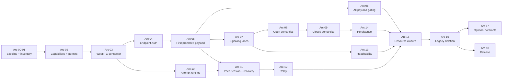

# MyOwnMesh existing-repository transition playbook

Status: stepped execution contract for transitioning the existing Rust repository to the adopted transport-independent hybrid networking architecture.

Repository target:

```text
upstream source:  mrjeeves/MyOwnMesh
architecture-owned fork: nathanfraske/MyOwnMeshSecurityReview
inspected upstream main: 9b5b4862d21ddbb92e9ff4fbbade47b41fe6fa75
inspected fork main:     28c9e27f89fdb8c2af9a9691a0fe0271befbe060
```

At inspection, upstream was two logging-focused commits ahead of the writable fork. Recheck both heads immediately before execution.

This playbook migrates the existing system. It does not authorize a clean-room rewrite.

## 1. Mission

The transition must preserve the working, field-tested network while replacing the authority model, state ownership, and cross-subsystem boundaries that conflict with the adopted architecture.

The migration formula is:

```text
wrap the working mechanism
    -> prove the target boundary
    -> redirect production callers
    -> delete the legacy authority path
```

The first product objective is a working end-to-end session on the new promotion boundary:

```text
existing signaling
    -> existing WebRTC/ICE transport work
    -> ConnectedChannelCapability
    -> channel-bound mutual Device authentication
    -> current Open or Closed policy
    -> principal-bound SessionCapability
    -> one existing application payload operation
```

Everything else builds outward from that vertical slice.

## 2. Non-negotiable constraints

1. **Transition, do not restart.** WebRTC, ICE recovery, Nostr, mDNS, STUN/TURN, native RTP media transport, daemon, GUI, installer, updater, diagnostics, and field-derived tests are assets. Fixed H.264, Opus, video, audio, and lane semantics are compatibility behavior to generalize, not basal architecture.
2. **Usability first, promotion secure.** Untrusted hints may cause bounded speculative networking work. They may not create durable authority, deliver application data, or promote a session.
3. **Transport independence, not transport removal.** The connector remains first-class and does real discovery, racing, measurement, migration, and recovery.
4. **No durable route ceremony.** Ordinary candidates, routes, current path, handoff, and reachability remain live connector/session state.
5. **One state class, one owner.** No `Arc<Mutex<GlobalState>>`, replacement engine grab bag, or global command/event enum.
6. **Open remains open.** Resource control cannot become disguised admission.
7. **Closed alone adds governance authorization.** Existing `auto_approve`, local roster mutation, or transport state cannot satisfy it.
8. **No ordinary mesh forwarding.** A relay is an explicit exact allocation carrying opaque endpoint packets.
9. **No new behavior in compatibility adapters.** Every adapter has a deletion arc.
10. **Do not invent numeric budgets.** Instrument the complete path, measure supported targets, and surface values for owner review.
11. **Own properties, not magnitudes.** This package fixes the *properties* of resource ownership. Capacity magnitudes come from a named provider supplied by the deployment or embedder, never from a document, default, or library constant. A concrete provider's arbitration algorithm is that provider's policy, not a basal architectural requirement.

## 3. Source-of-truth document set

Read in this order:

1. [`ARCHITECTURE.md`](ARCHITECTURE.md), the minimal system shape.
2. [`APPLICATION-INTEGRATION.md`](APPLICATION-INTEGRATION.md), the product-facing boundary.
3. [`IMPLEMENTATION-CONSTRAINTS-AND-INVARIANTS.md`](IMPLEMENTATION-CONSTRAINTS-AND-INVARIANTS.md), the concrete implementation contract.
4. [`FORMAL-PROOFS.md`](FORMAL-PROOFS.md), the proof obligations.
5. [`red-teams/MESH-ATTACK-VECTORS.md`](red-teams/MESH-ATTACK-VECTORS.md), source findings and adversarial gates.
6. [`ARCHITECTURE-OWNERSHIP.md`](ARCHITECTURE-OWNERSHIP.md), conflict and upstream policy.
7. [`CURRENT-TO-TARGET-MIGRATION-MATRIX.md`](CURRENT-TO-TARGET-MIGRATION-MATRIX.md), state-owner mapping.

No implementation PR may redefine a term already fixed by these documents.

## 4. Repository and branch setup

### Step 4.1. Synchronize the writable fork

1. Add or verify `upstream` points to `mrjeeves/MyOwnMesh`.
2. Fetch current upstream and record its exact commit.
3. Classify the difference from the fork using `ARCHITECTURE-OWNERSHIP.md`.
4. Fast-forward or cherry-pick all U0/U1 changes. At the inspected baseline, the two pending changes are logging-only and should be taken.
5. Run the full existing workspace and GUI checks.
6. Tag the exact pre-transition source. The final tag name is owner-selected; the tag must contain the upstream commit and date in its annotation.

### Step 4.2. Establish branch roles

Recommended roles:

```text
upstream/main
    read-only tracking reference

main
    architecture-owned, continuously buildable product branch

arc/<number>-<scope>
    one migration arc or tightly coupled vertical slice

intake/upstream-<date>-<short-sha>
    temporary branch for classifying and porting upstream work

repro/<case-id>
    isolated red-team or field-failure reproduction only
```

Branch names are workflow labels, not semantic authority.

### Step 4.3. Install the fundamental documents

Place this package at repository root, preserving the canonical names:

```text
ARCHITECTURE.md
FORMAL-PROOFS.md
IMPLEMENTATION-CONSTRAINTS-AND-INVARIANTS.md
APPLICATION-INTEGRATION.md
TRANSITION-PLAYBOOK.md
ARCHITECTURE-OWNERSHIP.md
CURRENT-TO-TARGET-MIGRATION-MATRIX.md
red-teams/MESH-ATTACK-VECTORS.md
diagrams/*
```

Do not retain a competing architecture document under another canonical name.

## 5. Migration operating model

### 5.1. Keep the current engine alive as a temporary supervisor

The existing per-network driver is the safest migration seam because it already serializes current events. During the transition it may:

- start and stop target nodes;
- translate legacy commands into narrow typed ports;
- translate target events back into legacy API events;
- preserve current behavior while callers migrate.

It may not gain new domain decisions. Its state must monotonically shrink.

### 5.2. Establish target nodes before crate extraction

Do not create a large new crate graph before state ownership is proven. Create narrow modules and actor/task owners inside `myownmesh-core` first:

```text
runtime/semantic
runtime/signaling
runtime/attempt
runtime/session_broker
runtime/peer_session
runtime/reachability
runtime/relay
connector
endpoint_auth
capability
resource
application_gateway
```

Extract crates only after:

- the owner has exclusive state custody;
- its ports are stable;
- legacy callers are gone;
- dependency direction is proven by tests.

### 5.3. Universal PR contract

Every migration PR must state:

```text
State class moved:
Old owner:
New sole owner:
New typed inputs:
New typed outputs:
Capability transition added or changed:
Pre-auth and post-auth resource effects:
Legacy adapter introduced:
Deletion arc for that adapter:
Production callers redirected:
Positive controls:
Negative controls:
Red-team cases:
Performance measurements:
Documentation updated:
```

A PR fails review if it adds a new `NetworkCmd`, global event, helper module, or shared mutable map without proving why the target owner cannot own the operation directly.

## 6. Target node ownership

| Node | Sole mutable state | Current sources initially feeding it | Must never own |
|---|---|---|---|
| Semantic Node | accepted durable facts, Open projection, Closed projection, durable grants/revocations, policy guards, verified durable basis | `roster.rs`, `network_state.rs`, `engine/governance.rs`, persistence | sockets, candidates, traffic keys, application queues |
| Signaling Node | carrier connections, durable anti-entropy, ephemeral-control routing, bounded carrier provenance | `engine/signaling_bridge.rs`, Nostr, mDNS, LocalBroker | roster decisions, endpoint identity, application delivery |
| Attempt Node | one attempt's candidates, speculative permits, race policy, cancellation, ephemeral correlation | `ensure_peer_session`, reconnect intents, signaling offer/answer flow | durable facts, application payload, session authority |
| Connector Worker | native connector state, a live connected channel, and optional connector-native data-plane providers | `transport/webrtc.rs`, ICE/TURN code, future relay connectors | mesh authorization, application codec or product meaning |
| Endpoint Auth Task | fresh channel-bound Device-authentication transcript | `engine/handshake.rs`, `signing.rs` | Open/Closed policy, application authorization |
| Session Broker | atomic promotion, current policy guard, principal binding, post-auth permits, capability minting | current approval/Active transition | packet loops, candidate gathering, durable governance |
| Peer Session Node | authenticated channels, traffic/replay state, session data-plane capabilities, application queues, recovery and local path selection | active peer state, heartbeat, ladder, reliable delivery, current media-flow ownership | durable fact construction, global topology authority, codec or screen/camera/audio semantics |
| Reachability Node | local signaling, candidate, channel, and session observations with local age | connection tracer, traffic recency, heartbeat, carrier diagnostics | participation or authorization |
| Relay Node | exact bounded opaque allocations and queues | `services/relay.rs`, TURN/generic relay code | endpoint keys, application parsing, fanout |
| Application Gateway | local principal, IPC connections, public handle leases, subscriptions | daemon control, `handle.rs`, GUI facade | internal SessionCapability construction, connector control |
| Runtime Supervisor | node lifecycle and configuration routing | current driver/service manager | domain state or authorization decisions |

## 7. Arc execution plan

Each arc ends with a buildable repository and a deletion or ownership reduction. Do not begin a later arc by bypassing an unfinished earlier gate.

### Arc 00. Baseline synchronization and documentation adoption

**Goal:** create a reproducible transition baseline with no semantic behavior change.

**Steps**

1. Synchronize the fork as described in Section 4.
2. Install the fundamental docs and diagrams.
3. Record workspace, GUI, package, installer, daemon, and integration test results.
4. Capture current connection traces for direct LAN, Nostr-signaled, mDNS-signaled, TURN, reconnect, network change, media, Channel, RPC, and daemon restart scenarios available in the test environment.
5. Record the current dependency graph and exact lockfile.

**Gate**

- Current behavior and packaging remain unchanged.
- Every test result names the exact commit.
- The source audit baseline in the red-team catalog is updated or accompanied by an exact delta note.

**Delete:** nothing.

### Arc 01. State and effect inventory

**Goal:** prove that every current mutable field, parser, constructor, queue, task, and external effect has one target owner.

**Steps**

1. Enumerate every field in `NetworkState`, `PeerConnection`, transport session state, signaling drivers, daemon client registry, relay service, and governance state.
2. Map each to the migration matrix.
3. Enumerate every `NetworkCmd`, `MeshMessage`, signaling message, transport callback, public send API, persistence write, and application callback.
4. Mark every payload bypass, ordinary forwarding path, authority mutation, and unbounded queue.
5. Add a `BOUNDARY.md` to every target module as it appears, with purpose, owned state, inputs, outputs, dependencies, resources, restart behavior, and forbidden responsibilities.

**Gate**

- No mutable field or effect is unassigned.
- No field has two final owners.
- Unknown or ambiguous cases are owner decisions, not guessed assignments.

**Delete:** no code, but no unowned feature work may merge after this arc.

### Arc 02. Capability and resource spine

**Goal:** install compile-time authority transitions without changing transport behavior.

**Create private-constructor types**

```text
ConnectorCandidateCapability
ConnectedChannelCapability
AuthenticatedChannelCapability
SessionCapability
LocalPrincipalCapability
PreAuthAttemptPermit
EndpointAuthPermit
SessionPermit
RelayAllocationPermit
ApplicationQueuePermit
```

**Steps**

1. Put capabilities in target-owned modules, not a generic `types` crate.
2. Make higher-authority capabilities non-serializable and non-constructible from public IDs.
3. Add compile-fail tests for forbidden conversions.
4. Add compatibility wrappers that carry legacy objects internally but expose the new capability types to new code.
5. Instrument current allocations by resource family without enforcing unmeasured values yet.

**Gate**

- No public constructor creates `SessionCapability`.
- A connected channel cannot be passed to an application send API.
- Public peer, route, client, request, and session labels cannot construct internal capabilities.
- Instrumentation reports item count, bytes, tasks, and lifetime by resource family.

**Delete:** any newly discovered direct constructor that has no production requirement.

### Arc 03. Wrap WebRTC as the first Connector Worker

**Goal:** preserve actual networking work while removing transport authority.

**Steps**

1. Define the narrow connector contract:

```text
start(intent, hints, permits)
receive_typed_control(...)
observe(...)
cancel(...)
    -> ConnectorCandidateEvent | ConnectedChannelCapability | Failure
```

The first WebRTC implementation uses this ownership relationship:

```text
one connection attempt
    -> multiple connector candidates

one WebRTC connector candidate
    -> one RTCPeerConnection and ICE agent
    -> multiple internal ICE candidates and candidate pairs

DataChannelOpen
    -> working ConnectedChannelCapability
    -> not authenticated session authority
```

2. Wrap `transport/webrtc.rs` without rewriting ICE, DTLS, TURN, native RTP track machinery, or the recovery ladder.
3. Split its public target boundary into the connected-channel connector and an optional WebRTC real-time flow provider. The initial implementation may remain in one source file, but the types and ownership must already be separate.
4. Route existing offer/answer/candidate flow through the connector wrapper.
5. Correlate callbacks through local attempt/candidate capabilities, not peer strings or durable route IDs.
6. Keep `MediaLaneOpen`, `MediaLaneClose`, H.264, and Opus behavior behind a compatibility adapter until Arc 06A.
7. Keep the legacy driver as caller through a compatibility adapter.

**Gate**

- Existing direct and TURN connections still establish.
- Connector output proves only a working connected channel.
- No application callback is reachable from the connector.
- Late callbacks for a dropped capability are ignored and cleaned up.

**Delete:** any transport-to-application callback made redundant by the wrapper.

### Arc 04. Extract Endpoint Auth

**Goal:** make exact Device authentication over the channel a standalone transition.

**Steps**

1. Move the channel-bound Ed25519 exchange from `engine/handshake.rs` into `endpoint_auth`.
2. Bind the transcript to exact MeshContext, local Device ID, remote Device ID, ordered roles, fresh contributions, and the connected channel's binding/exporter.
3. Return `AuthenticatedChannelCapability` on success.
4. Keep Open/Closed policy outside the authentication task.
5. Fail closed when a connector cannot provide the selected channel binding.

**Gate**

- Signaling MITM cannot relay authentication across two terminated transport legs.
- Authentication success does not expose application data.
- Replaying an old transcript cannot authenticate a different channel.
- The existing DTLS binding positive and negative tests continue to pass.

**Delete:** cryptographic identity decisions from the legacy approval state machine.

**Status (production-reachable, not complete).** This document claims no execution or audit result; citation requires exact-state local evidence and exact-head hosted/audit evidence recorded externally. Steps 1–5 are implemented and wired into the live `Hello`/`AuthResponse` handlers, with `EndpointAuthTask::authenticate` as the sole issuer and the resulting `AuthenticatedChannelCapability` owned by `PeerConnection` and enforced by every application, reliable, and real-time admission gate. Step 2's "binding/exporter" alternative was met with the **binding** option — both endpoints' DTLS certificate fingerprints, role-canonical — not an exporter; see the residual in `crates/myownmesh-core/src/endpoint_auth/BOUNDARY.md`. Step 5 is satisfied by `on_hello`/`on_auth_response` dropping the peer when either fingerprint is unavailable.

**This document does not declare the arc complete.** It claims no execution or audit result for any gate above; citation requires exact-state local evidence and exact-head hosted/audit evidence recorded externally. Gate line 3 in particular carries the guarantee here, because the fingerprint binding is not session-unique — cross-channel replay is prevented by per-attempt contributions and by connector-incarnation ownership, so that control must be run and cited rather than assumed.

### Arc 05. First Session Broker vertical slice

**Goal:** prove the new architecture end to end with one application operation.

**Steps**

1. Add a minimal Session Broker.
2. Feed it `AuthenticatedChannelCapability` from Arc 04.
3. Use a temporary policy adapter over current roster/governance state.
4. Bind one authenticated local principal.
5. Reserve post-auth session resources.
6. Mint a fresh non-serializable `SessionCapability`.
7. Route one typed `Channel<T>` operation through the new Peer Session shell.
8. Ensure the receiver delivers only after the same promotion boundary.

**Gate**

- Connected but unauthenticated channel: no payload.
- Authenticated but policy-denied channel: no payload.
- Authenticated and policy-allowed channel: positive-control payload succeeds.
- Restart invalidates the capability.
- Direct and TURN carriers produce the same remote Device identity.

**Delete:** the migrated Channel operation's old send and receive bypasses.

### Arc 06. Complete application payload gating

**Goal:** place all application data behind live SessionCapability.

**Migrate in bounded groups**

1. directed Channel send and receive;
2. broadcast as explicit bounded application fanout over independent sessions;
3. unary and streaming RPC;
4. reliable delivery;
5. capabilities exchange that is truly application-level;
6. video and audio send;
7. video and audio receive and IPC delivery;
8. daemon subscriptions and callbacks.

**Gate for every group**

- no serialization or queue insertion before the live handle guard;
- no inbound application state mutation before promotion;
- stale, foreign-principal, closed, or policy-invalidated handles fail;
- positive control is preserved;
- queue and task instrumentation exists.

**Delete:** peer-string, socket, route, `ClientId`, and transport-object authority paths for the migrated group.

### Arc 06A. Generalize Media Lanes into an optional real-time flow extension

**Goal:** preserve the field-tested WebRTC RTP path while removing codec and product semantics from basal MyOwnMesh.

**Steps**

1. Introduce connector/session-owned `RealtimeFlowProvider`, `RealtimeFlowHandle`, encoded-unit, and observation types with private constructors.
2. Move WebRTC RTP, RTCP, transceiver creation, track drain/revive behavior, m-line handling, and transport-specific measurements behind the WebRTC real-time flow provider.
3. Remove `LaneKind::Video` and `LaneKind::Audio` from the target core boundary. Move H.264, Opus, screen, camera, microphone, and product meanings to the application or a compatibility profile.
4. Map legacy `MediaLaneOpen`, `MediaLaneClose`, `VideoSample`, `AudioSample`, and current IPC operations onto the new provider without changing their observable behavior.
5. Require a live `SessionCapability` for application flow open, write, read, and close. Pre-authentication native tracks may exist only under the bounded quarantine rule.
6. Preserve native zero-copy or low-copy transport paths where measured. Do not force real-time units through the reliable JSON Channel/RPC path.
7. Allow connectors that do not implement real-time flows to report `UnsupportedDataPlane` while remaining fully conforming.
8. Migrate AllMyStuff and other consumers to application-owned flow descriptions, then delete the legacy media-lane compatibility surface.

**Gate**

- data-only sessions work without any media-track provisioning requirement;
- the core has no fixed codec, media purpose, or lane-count authority;
- WebRTC real-time behavior, latency, loss handling, and reopen behavior remain owner-acceptable under measurement;
- no pre-promotion encoded unit reaches an application or leaves as authenticated application data;
- an alternate connector without native media support still establishes ordinary sessions;
- compatibility code contains no new behavior and has an explicit deletion target.

**Delete:** direct core ownership of `LaneKind::Video`, `LaneKind::Audio`, fixed codec semantics, and legacy lane APIs after downstream migration.

### Arc 07. Split signaling into typed lanes

**Goal:** retain production signaling while separating durable semantics, ephemeral transport control, and application data.

**Steps**

1. Add an immutable outer lane discriminator before domain parsing.
2. Define separate closed unions for:
   - durable semantic exchange;
   - ephemeral transport control;
   - endpoint/session control where needed;
   - application frames on promoted channels.
3. Adapt Nostr, mDNS, LocalBroker, and self-hosted signaling to the lane contract.
4. Preserve bounded carrier provenance after semantic deduplication.
5. Route offer/answer/candidates to Attempt Nodes, not durable storage.
6. Route durable facts only to the Semantic Node.

**Gate**

- candidate exchange is not durable history;
- durable facts remain idempotent and transport-independent;
- neither signaling lane accepts ordinary application payload;
- carrier disconnect cannot synthesize durable leave or close a newer session;
- mixed-lane parser confusion tests fail safely.

**Delete:** signaling bridge paths that erase provenance or route all messages through one semantic handler.

### Arc 08. Open Semantic Node

**Goal:** replace current Open roster authority with permissionless durable semantics.

**Steps**

1. Implement canonical durable Open participation facts and pure derivation.
2. Add durable store and verified basis support needed for Open.
3. Implement bounded ingress, validation, conflict behavior, retention, and `Unknown` on proof loss.
4. Expose revocable local policy guards to the Session Broker and Peer Session Nodes.
5. Run current Open roster and new Open projection in differential mode for observation only.
6. Switch new-mode session admission to the new Open projector.

**Gate**

- any authentic Device may self-participate without sponsor or pair grant;
- identity rotation does not bypass global resource accounting;
- absence, signaling loss, and reachability failure do not synthesize withdrawal;
- ambiguous same-cell durable facts fail closed only for that cell;
- bounded speculative transport may proceed before projection completes, but promotion cannot.

**Delete:** Open authority from `roster.rs`, `auto_approve`, topology, and application policy.

### Arc 09. Closed Semantic Node and explicit state migration

**Goal:** replace legacy Closed governance without centralizing authority or silently reinterpreting old state.

**Steps**

1. Owner-select and test-vector the Closed governance proof profile.
2. Implement the pure Closed projector and conflict rule.
3. Bind every authority-bearing field into canonical signed content.
4. Expose current policy guards and invalidation.
5. Build an explicit legacy migration tool:
   - inspect legacy state;
   - produce a proposed new Closed context/genesis;
   - require owner/admin confirmation under the selected local-principal mechanism;
   - preserve source evidence separately;
   - never reinterpret old signatures as new proof.
6. Switch new-mode Closed sessions to the new projector.

**Gate**

- a fresh valid key is not Closed-authorized;
- `auto_approve` cannot add Closed authority;
- local control clients need authenticated administration capability;
- concurrent governance conflict follows only the selected rule;
- Open records carry no authority into Closed;
- relevant removal invalidates policy guards before further protected operations.

**Delete:** legacy Closed authority, legacy split adoption, and legacy role/topology authority after migration support has completed.

### Arc 10. Attempt Nodes and candidate racing

**Goal:** replace per-network candidate orchestration with one bounded owner per attempt.

**Steps**

1. Create one Attempt Node for each outbound request or accepted inbound attempt.
2. Move speculative permits, candidates, offer/answer state, cancellation, and connector-worker ownership into it.
3. Race eligible direct, ICE, TURN, generic relay, and Closed member relay candidates according to local policy.
4. Do not require direct exhaustion before relay attempt.
5. Run policy lookup and transport establishment concurrently where safe; require policy only at promotion.
6. Emit precise failures: no signaling, no viable transport, endpoint auth failure, policy failure, resource limit.

**Gate**

- no candidate object survives its attempt capability;
- one failed or malicious origin stays within pre-auth budgets;
- first working channel proceeds immediately to Endpoint Auth;
- no durable path or route identity is created;
- time-to-candidate, time-to-channel, time-to-auth, and time-to-promotion are measured separately.

**Delete:** reconnect/candidate state from `NetworkState` and global command handling.

### Arc 11. Peer Session Node, recovery, and handoff

**Goal:** make one node own all post-promotion transport and application-session state for an endpoint relationship.

**Steps**

1. Move authenticated channels, traffic keys, replay state, app queues, and current local send selection into Peer Session Node.
2. Relocate heartbeat, inbound-recency confirmation, network-change recovery, ICE restart, rebuild ladder, and media ownership.
3. Permit multiple authenticated channels temporarily.
4. Attempt replacement channels while the current channel remains active.
5. Attach a replacement only after fresh endpoint authentication or an owner-selected current-session channel confirmation construction.
6. Select outbound channel locally; no global switch or relay-to-relay handoff.
7. Close or retain the old channel according to local measured policy.

**Gate**

- old-channel replay does not authenticate on replacement channel;
- a relay or signaling sender cannot issue a switch command;
- dropping the old path may influence failover timing but cannot authorize the replacement;
- current field-tested recovery positive controls remain;
- no persistent PathID, path generation, or current route exists.

**Delete:** active peer-session state from the legacy per-network driver.

### Arc 12. Exact relay profiles and ordinary-routing deletion

**Goal:** retain relay usability without ordinary member forwarding.

**Steps**

1. Implement a generic exact opaque relay allocation profile.
2. Implement Closed member relay as a visible Device B capability where selected.
3. Bind each allocation to exact endpoints, context, attempt/channel, finite resources, and exact destination.
4. Forward endpoint-authentication and encrypted endpoint packets only.
5. Keep relay, signaling, and endpoint roles semantically distinct even when co-located.
6. Port any useful current relay networking mechanism and tests.
7. Delete legacy routed send and plaintext/fanout relay behavior.

**Gate**

- B cannot read or author accepted A-C application payload;
- no arbitrary destination or fanout;
- no anonymous relay attestation;
- no relay-to-relay handoff dependency;
- every allocation, retained byte, queued value, and retry owns a finite lease, while provider bandwidth and optional cost policy remain explicit;
- direct and relay paths expose the same endpoint identity.

**Delete:** `engine/routing.rs` production path and nonconforming `services/relay.rs` behavior.

### Arc 13. Reachability and diagnostics

**Goal:** expose useful network state without making it authority.

**Steps**

1. Create the Reachability Node.
2. Feed it signaling responsiveness, candidate status, connected-channel state, endpoint-authenticated channel state, active session state, latency, loss, and local observation time.
3. Preserve field-tested inbound-traffic confirmation as the strongest current path evidence available to that profile.
4. Expose a vector rather than one authoritative `Online` bit.
5. Keep carrier provenance bounded and diagnostic only.

**Gate**

- missing observations never produce withdrawal/removal;
- remote or carrier timestamps do not supply local freshness;
- applications can distinguish roster, signaling, candidate, authenticated-channel, and session states;
- connector recovery continues to use reliable live evidence.

**Delete:** any existing status field that conflates durable participation with current transport.

### Arc 14. Durable persistence, compaction, and uniform store opening

**Goal:** make durable semantics reopenable without restoring live network authority.

**Steps**

1. Persist only durable semantic state, verified basis material, and exact durable pending-effect state.
2. On every start, use one `OpenStore` path, regardless of storage history.
3. Reconstruct no sockets, candidates, channels, traffic keys, replay windows, observations, reservations, or session handles.
4. Implement independently reopenable compaction bases only after extension-equivalence tests exist.
5. Ensure facts reference facts; continuation evidence and bases do not become authors or semantic facts.

**Gate**

- opening the same store reproduces durable state only;
- no historical effect is replayed merely because state was reopened;
- predecessor-base storage is removable only when current base verification and ordinary continuation remain self-contained;
- unresolved conflict and live-dependent durable evidence are preserved;
- whole-witness rollback limits are documented honestly.

**Delete:** any persistence path that serializes live session or route authority.

### Arc 15. Resource closure

**Goal:** replace instrumentation-only accounting and unleased work with property-level resource ownership: every protected allocation, retained value, task, queue entry, native object, and scheduled work unit is dominated by a live finite lease from a named provider.

**Provider boundary**

This arc fixes ownership properties. It does not fix which provider supplies capacity, and it writes no capacity value.

**`E` and `B` are orthogonal premises, not a hierarchy.** A cgroup, job object, process limit, or appliance bound is an `E`: it will stop the process at that value. That is containment, and it does not mean the capacity is obtainable — a process inside a 2 GiB envelope has no guarantee that 2 GiB is available, only that it will be stopped at 2 GiB. `B` is an actual reserved or owned guarantee: capacity held for this process.

Neither implies the other in either direction. Containment without reservation is ordinary; reservation without containment is equally possible. Both premises are proved **separately and per resource dimension**, so a provider may hold `E` in one dimension, `B` in another, both in a third, and neither in a fourth.

```text
accounting-only
    neither E nor B proved for the dimension
    the grant is a bookkeeping vector the process was told to respect

isolated
    E proved: something outside stops the process at E
    says nothing about whether B holds

backed
    B proved: capacity is actually held for this process
    says nothing about whether E holds

optional local ceilings
    explicitly optional and owner-selected; this process's own policy,
    not an E, and never a basal product limit
```

These names describe which premises are proved and rank nothing. "Backed" is not a stronger form of "isolated", neither subsumes the other, and inferring either from the other is the overclaim this split exists to prevent.

The deterministic finite provider used for tests and explicit local envelopes proves neither premise and is **accounting-only**; an owner-supplied grant vector is **not** host backing and establishes neither `E` nor `B`.

**Slice C handoff, recorded as a future requirement and not implemented here.** Every `Gc <= E` or `Gc <= B` claim requires a **dimension-specific, unit-correct, monotone mapping** between the MyOwnMesh `ResourceClaim` quantity and the substrate quantity actually contained or reserved. Where no such mapping exists for a dimension, that dimension **stays accounting-only and is recorded as an explicit residual** — it does not become `E` or `B` by assertion. The dimensions each needing their own mapping or their own residual disposition are the `ResourceClass` variants: `AccountedMemoryBytes`, `QueuedBytes`, `SocketOrHandle`, `NativeTransportObject`, `WorkerOrTask`, `CallbackOrScheduledWork`, `StorageBytes`, `StorageObject`, `RelayOrProviderAllocation`, `ParsingOrCpuWork`, and `OpaqueDependencyResidual`. **`OpaqueDependencyResidual` does not become `E` or `B` merely because it is numbered**: a quantity that is merely recorded is neither contained nor reserved. `FORMAL-PROOFS.md` §14.5 states the full set of mapping conditions — the three original properties plus `coverage`, `composition`, `subject alignment`, `lifetime and loss`, and `B exclusivity`, the last applying to reservation only, since containment is shareable but a double-promised reservation was never one. This arc defines, proposes, and implements no mapping.

The provider port is an injection point, not a fixed implementation. Any provider that satisfies the property gate below conforms. A provider that cannot name where its capacity came from does not conform.

The arbitration order and rotation rule of whichever provider is installed are that provider's concrete policy. They are verified against that provider, they are not basal architecture, and replacing a conforming provider with another conforming provider does not reopen the property gate.

Pending-demand retention is likewise policy, not architecture. This arc requires no pending-demand mechanism at all. Selected turns, exact-charge reservation, cooperative entry, and drop-cancellation belong to the concrete provider gate. The property gate states only what must hold *if* a provider retains capacity for a waiting demand.

**Fairness attribution vocabulary.** `ARCHITECTURE.md` fixes P1 through P8 and the closed FairnessRoot and AttributionChildScope definitions. This playbook uses them and does not restate or vary them; where the two appear to differ, `ARCHITECTURE.md` governs. What follows is only what P6 means for this transition.

**P6 is partition non-amplification, also called subdivision monotonicity.** It is checkable on a bounded execution and needs no limit argument.

**Fix the input workload, not a trace of outcomes.** Releases are derived: when an owner releases depends on when its work was admitted, so a release time is an output of the schedule under test. Fixing releases compares two different workloads and can manufacture or hide a difference. Hold fixed only:

```text
fixed input workload
    a finite set of FairnessRoots
    the initial provider state, including Gc in every dimension
    the arrival events: which demand arrives when, from which root
    per demand: a stable DemandId, exact claim, authority class,
        reclaimability
    one deterministic owner response rule for admitted work

derived, never fixed
    releases, the decision sequence, and every observable compared
```

**Normalize the topology.** Both runs use the identical, pre-existing root and child-scope topology with identical bookkeeping claims, and `DemandId`s are stable across runs. The only permitted difference between baseline and subdivided is the **mapping from `DemandId` to `AttributionChildScope`**. No scope is created inside the comparison, which removes scope-creation cost as a confound at its source rather than compensating for it afterwards.

**Bookkeeping is real, finite, and fallible.** Scope and reservation bookkeeping consume actual charged resource, that charge can fail, and scope creation can be refused under pressure like any other claim. Fixing the topology is a property of the comparison, not a promise that scopes are free, unbounded, or always creatable. Nothing here promises unlimited scopes.

**Drive both runs from a deterministic, clock-free environment.** The environment is a reducer over the fixed workload that interleaves exogenous arrivals with derived owner actions produced by the deterministic owner response rule. It reads no clock, no entropy, and no host fact. Permit **terminal stuttering**: once a run has no further action it takes no-op steps, so both runs stay comparable over the same prefix length instead of one simply ending sooner.

**Compare every decision prefix, not end state.** An end-state comparison lets a provider amplify `A` early and repay later. For every decision prefix `k`, meaning the first `k` provider decisions:

```text
for every decision prefix k:

    cumulative selections of A
        (subdivided)  <=  (baseline)

    for every resource dimension d:
        cumulative admitted quantity of A in dimension d
            (subdivided)  <=  (baseline)

for every competitor B != A, and every selection of B in the baseline:
    that selection occurs in the subdivided run at a decision index
    no later than its baseline index

absence convention
    a selection that never occurs has index infinity, so a baseline
    selection the subdivided run never makes counts as later and fails
```

Three quantifiers bind at once — every prefix `k`, every dimension `d` for admitted quantity, and every competitor `B != A`. Dropping any one weakens the property: omit the per-dimension check and subdivision may amplify in an unwatched dimension; pick a single competitor and it may amplify against the others. Both `A` bounds are cumulative at each `k`, not totals.

**It is one-way, not equality.** P6 does not require total outcome or share equality and does not require an identical decision sequence. A subdivision that leaves `A` worse off, or leaves a competitor better off, is fully conforming: the property is a ceiling on what subdivision can gain, not a guarantee that subdivision is free. Do not state it as "the partition is invisible" — that is too strong and would fail correct providers.

It fixes no share, no ratio, no quantum, and no scheduler. A provider may give roots wildly unequal outcomes for any local reason and still satisfy P6. A test that only shows each scope is eventually served is a different and weaker statement and does not test P6.

**What P6 does not claim.** These are unsupported claims, not open work items, and no future correction to the disclosed gap supplies them:

- P6 does **not** claim a FairnessRoot corresponds to a real-world claimant, principal, human, device, account, organization, or network peer;
- P6 provides **no Sybil resistance**. It constrains subdivision beneath a root and is silent about how many roots exist or how they came to exist. If an actor is assigned several roots, P6 places **no bound on that actor's aggregate treatment** — it neither promises nor denies any particular aggregate outcome, because it says nothing about root count at all. Bounding aggregate treatment across roots requires a separate mechanism that this document does not supply;
- P6 is not an authorization, admission, identity, or anti-abuse property, and satisfying it implies nothing about P1 through P5, P7, or P8.

**Trusted-local mapping is allowed.** A trusted provider or ingress owner may map a local ingress source, carrier, listener, connector instance, local account, or other locally selected value onto a FairnessRoot. That mapping is provider and deployment policy. This playbook fixes no root taxonomy, no principal enumeration, and no scheduler model, and P6 requires none.

The boundary is between locally verified input and unverified assertion, not between kinds of real-world entity:

- The trusted provider or ingress owner **may** use facts it has itself verified or authenticated as mapping inputs — an authenticated local principal, a verified or isolated ingress domain, and similar locally established facts.
- The FairnessRoot value itself **remains opaque.** It is process-local, never transmitted, and never compared across processes; the mapping input is not the root.
- **No unverified claimant, peer, or wire assertion may directly name, select, split, rotate, or multiply a root.** Mere submission over the wire is never sufficient — local verification is what makes an input usable.

This is a provenance rule about what the provider may trust as input, not a premise that a root corresponds to a real-world identity. Nothing here weakens the nonclaims above.

Scheduling outcome is a property of FairnessRoots. Accounting detail is a property of AttributionChildScopes. A provider that rotates over AttributionChildScope identities instead of FairnessRoots makes its decision sequence depend on how a root's demand is subdivided beneath it, which is exactly the prefix inequalities above failing.

**Steps**

1. Define the resource provider port, finite claim vector, exact lease, typed pressure results, and explicit residual classification. Keep the port injectable so a provider proving neither, either, or both of `E` and `B` can be installed without changing owners, and require each to declare per dimension which premises it has actually proved.
2. Make every protected allocation, retained value, task, queue entry, native object, and scheduled work unit hold a live lease.
3. Issue AttributionChildScopes without multiplying the process grant, and without letting any of them create a share or a turn.
4. Replace unleased channels, maps, task spawns, queues, retries, and storage with typed admission and pressure results.
5. Keep one process grant shared and work-conserving, with no weights, quotas, reserved shares, or partitions. State the installed provider's retention and arbitration as concrete provider policy: the current deterministic finite provider represents one exact move-only pending demand per FairnessRoot, reserves only that demand's exact charge so surplus stays borrowable, selects `Cleanup > Admitted > Speculative`, and rotates equal-class selection across FairnessRoots after each resolved demand. Document that retention, order, and rotation as this provider's policy, not as a basal limit on conforming providers. Record that both the demand cursor and the reclaim cursor are root-keyed, which is what removes the previously disclosed subdivision counterexample.
6. Keep protocol bounds, provider structural limits, runtime availability, and optional local ceilings distinct.
7. Let a provider request retirement only from the exact owner of a lease whose owner contract declares it reclaimable; the current deterministic finite provider treats `Speculative` leases as that reclaimable class, which is provider policy rather than a basal requirement. Keep disposition with owner Drop after cleanup or explicit failed-cleanup retention. Add no timer and claim no guarantee against nonreclaimable admitted pressure, ignored retirement, or failed cleanup.
8. Test the property gate and the provider policy separately. Property tests cover identity rotation, many-source pressure, unequal claim sizes, exact release, conservation under concurrent charges, child-scope borrowing, cooperative retirement, ignored retirement, failed-cleanup retention, pre-reserved cleanup under a full grant, optional ceilings including the all-absent case, slow work, and storage-backed work. Provider-policy tests cover move-only pending demand, exact-charge reservation, cooperative entry, drop-cancellation, authority ordering, equal-class rotation, victim-set proof, and arbitration determinism against the installed provider. Add the P6 test as a subdivision-monotonicity test over a fixed input workload: fix the root set, the initial provider state including `Gc`, the arrival events, each demand's claim, authority and reclaimability, and one deterministic owner response rule, letting releases derive. Run the workload once with root `A` unsubdivided as baseline, then again with `A`'s demand spread across additional AttributionChildScopes beneath `A` and nothing else changed. Assert at **every decision prefix `k`** that `A`'s cumulative selections do not exceed baseline, that `A`'s cumulative admitted quantity does not exceed baseline **in every resource dimension `d`**, and that for **every competitor `B != A`** each baseline selection of `B` occurs no later than its baseline index, treating an absent selection as index infinity. Do not assert total outcome or share equality, and do not fail a subdivision that leaves `A` worse off or a competitor better off. The **first** such test is topology-normalized: both runs use the identical pre-existing root and child-scope topology with identical bookkeeping claims and stable `DemandId`s, so only the `DemandId`-to-`AttributionChildScope` mapping differs and no scope is created inside the comparison. Drive both from the deterministic clock-free environment, interleaving exogenous arrivals with derived owner actions and allowing terminal stuttering, over a bounded decision prefix that starts identical in both runs and during which none of the compared newly admitted work releases — that exact condition, not the broader "no release at all", since unrelated releases elsewhere need not be prohibited. Do not read the normalization as promising unlimited scopes: bookkeeping is real, finite, and fallible, and scope creation can be refused under pressure. A test that only shows each scope is eventually served does not test P6. Pair the positive control with a negative fixture that forces scope-keyed selection and requires the oracle to reject it, so a passing result cannot be vacuous. Property tests must also cover P4-constrained refusal (a fitting claim refused while usable capacity sits idle and unreserved is a failure, outside the three exception classes, with fit taken as `EffectiveFit(d) = max(0, EffectiveCapacity(d) - S(d) - R_flight(d))` over absolute capacity narrowed only by FORMAL's closed P5 vocabulary and intersected with each independently proved `E` or `B` premise) and safe committed-grant contraction (assert `S <= Gc` continuously; that premise loss recomputes rather than freezing, leaving residual headroom work-conservingly usable while `EffectiveCapacity >= S + R_flight` and never freezing merely because `E < Gc` or `B < Gc`; that an `O` alone moves no grant, admission result, or contraction state and sets nothing automatically; that a `T` arises only by being set directly by a named owner policy or derived by a named owner policy considering `O`; that `Gc(d)` is never set below `S(d) + R_flight(d)`, so contraction cannot strand an in-flight reservation; that `Gc <= E` is proved only where an envelope actually exists and `Gc <= B` only where capacity is actually reserved; and that premise loss is tested in **both** regimes — a fall that still covers `S(d) + R_flight(d)` leaves headroom usable and emits **no** loss report, while a fall below it reports typed containment-loss, backing-loss, or external-overcommitment distinctly, each retaining every charge and reservation, refusing conflicting new work, and claiming no envelope or backing that is not there. A control that reports loss merely because `E < Gc` or `B < Gc` is testing the wrong threshold and must be corrected rather than recorded as passing). Also test that `E` and `B` are each declared and proved independently per dimension, that neither is inferred from the other, and that an owner-supplied grant vector is not reported as either. Do not write a test that expects a typed result from an OOM kill or other fail-stop: those produce no typed result, and a control asserting otherwise is testing something the system cannot do. Equally, do not write a test asserting that substrate-owned resources vanish at process death — that is unproved, and a control assuming it would encode the convenient answer rather than a verified one. The P6 controls implementing the above are **landed in the working tree**, and this playbook claims no execution result for them. An earlier revision described a *superseded* selection-only test as the formal control; that was an overclaim and was withdrawn, and the history is kept so it cannot quietly reappear. Both defect dispositions are landed: requester-root propagation, whose selector parameter is non-optional and **fails closed** by poisoning rather than reclaiming unattributed; and proof-control fidelity, whose trace is an ordered record of **cooperative-admission dispositions on the non-failing path** — acceptance, same-root refusal, immediate grant, arbitration grant, terminal pressure, and owner cancellation — complete within that scope and no wider, excluding fail-closed invariant cancellation and teardown cancellation, with logical ids bound at issue rather than reconstructed positionally. Recorded quantities are variant-specific: acceptance and same-root refusal carry the exact **requested** claim by dimension as recorded by the provider, the two grant variants carry `requested` and the internal `charged`, and terminal pressure and cancellation carry neither; the oracle accumulates provider-recorded `requested` claims **from grant events only**, the internal charge being inflated by bookkeeping, not the quantity Note 14.5e defines, and diagnostic only. Record the same four limits wherever this is cited: bounded and never a whole-model proof; scoped to cooperative admission on the non-failing path; working-tree scope with no execution result claimed here, so citation requires exact-state local verification and exact-head hosted evidence recorded externally, and it is neither exact-head nor hosted CI; and no deployed multi-root mapping, since extra trusted roots and cross-root exercises are `#[cfg(test)]` only. The property gate is not satisfied merely because the provider-policy tests pass.
9. Measure performance, provider cost, scheduling, regression, and opaque residuals without deriving universal object counts.
10. Require the deployment or embedder to name the installed provider and the origin of its capacity. Ship no default grant, no library-supplied numeric value, and no invented ceiling.

**Gate: property-level resource ownership**

This is the transition gate. It is stated as properties of ownership, and any conforming provider may satisfy it.

- **Domination.** Every named protected allocation and scheduled operation is dominated by a live finite lease, and every lease names its provider, its resource dimension, and its owner.
- **Conservation.** Exact lease release restores exactly that capacity and nothing else; concurrently held charges never exceed the grant in any dimension.
- **No capacity minting.** Creating, cloning, or nesting a scope creates no capacity, and no accounting, attribution, or observation path can mint any.
- **Impossibility.** A composite claim that does not fit the grant is refused; one large claim may cost more than many small claims, so no object count implies admissibility.
- **Pressure is not authorization.** Refusal names a resource dimension rather than an object count; resource refusal is never an Open or Closed authorization result, and Open overload is reported as resource pressure, never as unauthorized identity.
- **Non-interchangeable permits.** Pre-auth and post-auth permits cannot substitute for each other.
- **Connector-local scheduling metadata is not capacity.** A scheduling weight, quantum, or share is connector-local ordering only; it reserves no provider capacity, guarantees no cross-scope admission, and multiplying it multiplies no grant. This is a claim about capacity authority and does not discharge P6 partition non-amplification below.
- **Partition non-amplification, or subdivision monotonicity (P6).** Over one fixed *input workload* with releases derived, subdividing root `A`'s demand across additional AttributionChildScopes beneath `A` must satisfy, **at every decision prefix `k`**: cumulative selections of `A` no greater than baseline, cumulative admitted quantity of `A` no greater than baseline **in every resource dimension `d`**, and every baseline selection of every competitor `B != A` occurring no later than its baseline index, with an absent selection taking index infinity. The gate control compares exactly those quantities against the unsubdivided baseline; it must not require total outcome or share equality, and must not substitute eventual service of each scope. The **first** such control is topology-normalized: identical pre-existing root and child-scope topology, identical bookkeeping claims, stable `DemandId`s, and only the `DemandId`-to-`AttributionChildScope` mapping differing. It runs both under the deterministic clock-free environment with terminal stuttering, over a bounded decision prefix that starts identical in both runs and during which none of the compared newly admitted work releases; unrelated releases elsewhere need not be prohibited. Normalizing the topology is not a promise that scopes are free or unlimited — bookkeeping is real, finite, and fallible. P6 claims nothing about real-world claimants and gives no Sybil resistance; those are unsupported claims rather than pending work. **Status: scheduling and controls landed in the working tree; this playbook claims no execution result.** The installed deterministic finite provider rotates equal-authority turns over FairnessRoots — both the demand cursor and the reclaim cursor are root-keyed — so subdivision creates no additional turn key and the disclosed rotation-key counterexample is removed. Controls compare baseline and subdivided runs against the live provider over an ordered trace of **cooperative-admission dispositions**, complete for that scope and no wider, with a negative fixture reverting production selection to scope keying that the oracle must reject. Both defects' dispositions — requester-root propagation, whose selector is now non-optional and fails closed by poisoning rather than reclaiming unattributed, and proof-control fidelity — are landed. **No execution result is claimed here**; citation requires exact-state local verification and exact-head hosted evidence recorded externally. An earlier revision's description of the superseded selection-only test as the formal control was an overclaim and was withdrawn. **All of this is working-tree scope, not exact-head and not hosted CI.** Roots stay provider-private: a root is minted only for a parentless scope, ordinary children inherit it verbatim, and public child creation can neither name, mint, nor rebind one. The production consequence: production has **one scheduling root**; **child subdivision cannot multiply turns**; **cross-root production fairness is not claimed**; and **future trusted-root assignment belongs to its owning provider or ingress arc**, with additional trusted roots and cross-root exercises `#[cfg(test)]` only and no production root taxonomy added here.
- **Cleanup ownership.** Cleanup capacity that must be available under every condition is reserved before allocation, so cleanup proceeds from its pre-reserved claim even when the grant is full; disposition remains owner Drop after cleanup or explicit failed-cleanup retention, and no provider releases or invalidates an owner's lease.
- **Explicit isolation.** Unused capacity is borrowable unless an explicit local isolation policy forbids it; isolation is opt-in and named, never implied.
- **Conditional pending-demand safety.** This gate requires no pending-demand mechanism. *If* a provider retains or reserves capacity for a waiting demand, that retention mints no capacity, releases or invalidates no other owner's lease, blocks no surplus beyond what that demand itself requires absent an explicit named isolation policy, creates no admission guarantee against nonreclaimable admitted pressure, and ends when the demand ends without a timer. A provider that never retains has nothing to check in this bullet — the next one binds it regardless. Exact-charge reservation, selected turns, cooperative entry, and drop-cancellation are concrete provider policy and are gated below, not here.
- **P4-constrained immediate refusal.** A provider may implement no pending retention and answer with immediate typed pressure instead — but **only when the claim does not currently fit.** A fitting claim must be admitted. Declining to implement retention decides how a non-fitting claim is answered, never whether a fitting one is admitted. P4 work conservation binds independently of retention: refusing a fitting claim while capacity able to satisfy it is neither live nor reserved for an in-flight admission is a P4 violation. Exactly three exception classes permit refusing a fitting claim, and no others are recognized: **(1)** a proven provider structural limit applies — proven, not assumed, since an unproven claimed limit is a stop condition; **(2)** an explicit local isolation policy or optional ceiling refuses it, and the refusal names that policy; **(3)** provider accounting is unavailable, poisoned, or cannot prove the admission safe, in which case refusing is correct and admitting on unprovable accounting is not. Fit itself means `EffectiveFit(d) = max(0, EffectiveCapacity(d) - S(d) - R_flight(d))`, where `EffectiveCapacity(d)` is the absolute `AccountingCapacity(d)` intersected with `E` and with `B` only where each is proved, independently and per dimension since neither premise implies the other. Admission requires `q(d) <= EffectiveFit(d)`. Neither takes `O` or `T` as an input, and no provider may intersect against an `E` or `B` it does not actually have. Capacity reserved for an in-flight admission means the claim does not currently fit and is **not** a separate exception. Typed containment loss, backing loss, and external overcommitment — each triggered by a premise falling below `S(d) + R_flight(d)`, never by `E < Gc` or `B < Gc` alone — are affected-capacity, unprovable-safe-accounting, degraded-state conditions covered by class 3 with the fit condition, and are **not** separate classes. A refuse-only provider is nonconforming, not trivially conforming. Nothing here implies liveness, a queue, or a deadline, and every refusal is a typed availability result under P7.
- **Safe committed-grant contraction.** Model contraction over five distinct quantities per dimension, and never conflate any two:

These symbols are defined by [`FORMAL-PROOFS.md`](FORMAL-PROOFS.md) §14.5. The gloss below summarizes them for readability and does not redefine them; **where this summary and FORMAL differ, FORMAL governs and the difference is a defect here.** This playbook keeps no parallel notation glossary — symbols it does not need are left to FORMAL.

```text
S    charged sum: live claims plus failed-cleanup-retained claims
Gc   provider-owned committed grant — an accounting commitment only,
         never proof of containment and never proof of availability
O    optional, inert observation or measurement
T    explicit owner-selected contraction target
E    enforceable isolation envelope or ceiling — containment only
B    actual reserved or owned guarantee — capacity held for this process

AccountingCapacity(d)
     the absolute Gc(d), narrowed only by an explicit P5 restriction
     naming the exact subject
EffectiveCapacity(d)
     AccountingCapacity(d) intersect E where E is proved,
     intersect B where B is proved, per dimension and independently
         neither proved  => EffectiveCapacity = AccountingCapacity
         E only          => AccountingCapacity intersect E
         B only          => AccountingCapacity intersect B
         both            => AccountingCapacity intersect E intersect B
EffectiveFit(d)
     max(0, EffectiveCapacity(d) - S(d) - R_flight(d))
admission
     q(d) <= EffectiveFit(d)
```

  Capacity is **absolute**; fit is the headroom left inside it. A composite claim fits only when it fits in **every dimension it names** — headroom in one never compensates for its absence in another. `S(d)` and `R_flight(d)` are subtracted **last**, because `E` and `B` are absolute substrate bounds and intersecting them with an already-deducted figure would understate them. `R_flight(d)` is subtracted so concurrent admissions cannot each read the same headroom as free; it is the **aggregate** capacity reserved across **all** admissions in flight, zero when none is, and a distinct symbol from the global `R` that FORMAL uses for the lease-claim multiset — the two are never interchanged. The `max(0, ...)` clamp makes an over-committed dimension refuse rather than yield a negative bound that later arithmetic might treat as slack.

  **The P5 restriction vocabulary is closed.** An explicit restriction narrowing `AccountingCapacity` is exactly one of three forms, per `FORMAL-PROOFS.md` §14.5: a **named local isolation domain** confining a scope to part of the dimension; a **named partition or reserved share**, being a named division of the dimension or a quantity withheld from general admission for a named scope; or a **named optional local ceiling or cost boundary**, an explicitly named upper bound below `Gc` selected for policy, appliance, deployment, or cost reasons. Each is explicit, named, and recorded. **Nothing outside this list narrows `AccountingCapacity`** — not an observation, target, measurement, generic owner preference, workload calibration, anticipated future demand, rate smoothing, inferred restriction, or undeclared product policy. An undeclared narrowing is an arbitrary refusal, which P4 forbids.

  **Neither `O` nor `T` is ever a fit input.** A provider never presents unproved containment or backing as established: an accounting-only committed grant is an accounting commitment, not proof that substrate capacity exists or that allocation will succeed. **Accounting-only is honest but not sufficient alone for final production closure** — where nothing is proved, `EffectiveCapacity` equals `AccountingCapacity` and no substrate premise narrows it. **A successful admission guarantees nothing downstream**: allocator, kernel, runtime, transport, external-relay, and hardware failure remain real and application-visible, and callers must still handle them.

  Their authorities differ. **`O` is optional and inert** — it changes no grant, admission result, or contraction state, never sets anything automatically, need not exist at all, and creates no provider class. **`T` arises only by named owner policy**: either set directly, or derived by a named policy that considers `O` among its inputs; `T < Gc` requests contraction and `Gc` follows downward only after owner release has lowered committed use, never below `S(d) + R_flight(d)`. **`E` contains, `B` guarantees, and neither implies the other** — a provider proves `Gc <= E` only if it actually has an envelope, and `Gc <= B` only if capacity is actually reserved. The two are proved independently and per dimension; it may claim neither by default, and holding one is never evidence for the other. The invariants: `S <= Gc` continuously, and **the contraction floor is `S(d) + R_flight(d)`, not `S` alone** — contracting to `S` would strand capacity already reserved for an admission in flight. **Premise loss has two regimes, keyed on `S(d) + R_flight(d)` and never on `Gc`**: where a fallen premise still stands at or above `S(d) + R_flight(d)`, residual headroom remains usable, `EffectiveFit(d)` is recomputed against the reduced premise, and **no loss report is required at all**; only where the premise falls below committed use does the provider report a typed containment-loss, backing-loss, or external-overcommitment result and refuse work conflicting with the shortfall. **Never report loss or stop admitting merely because `E < Gc` or `B < Gc`** — that compares a premise against the accounting commitment rather than against what is committed, and treating every fall as an emergency refuses work the provider can honor while reporting a loss that has not occurred. In both regimes every charge and every reservation is retained, nothing is released or written off, a premise falling is not a release, and **no part of a shortfall is reported as available**; retirement requests go only to the exact owner of a lease its own contract declares reclaimable, sticky and without a timer; owner Drop after cleanup or explicit failed-cleanup retention remains the only path out of a charge (P2). Contraction is an outcome of releases, never a reclamation mechanism. **If backing cannot be proved, that remains the open Slice C question** — the provider has not failed, it simply may not assert it.
- **Typed reporting is bounded by liveness and observability.** Every typed state above can be produced only while the process is alive and the condition is observable to it. An out-of-memory kill or other fail-stop **produces no typed result**: the process is gone before it can classify anything. Process death **destroys live in-process capabilities** — leases, pending demands, and in-memory ownership records cease to exist rather than being released, retired, or reported, and no cleanup path runs for them. Recovery is **ordinary restart**, reconstructing no leases and inheriting no charges. **This says nothing about what survives outside the process.** Do not assert that every external reservation, provider allocation, retained charge, or cleanup obligation ceases at process death: a substrate-owned resource such as a TURN or relay allocation, an assigned hard domain, or an OS-owned object may survive it, and its disposition belongs to whoever owns it. Reconciling substrate-owned resources after process death is an **open concern** this gate does not discharge and no control here covers; assuming they vanish with the process is the convenient answer and is not a supported one.
- **Hostile-ingress progress and backpressure is a separate obligation.** Ingress owners bound admission before work is created, apply backpressure or typed refusal at the ingress boundary, and keep unrelated work progressing while a hostile source is active. **No property in this gate discharges it.** P6 governs subdivision beneath a root and says nothing about an attacker driving unbounded ingress at a listener. Satisfying every other bullet here leaves this open.
- **No basal cardinality.** No `unlimited` sentinel, default grant, hidden default cardinality, or basal maximum Mesh, peer, attempt, session, or flow count exists; the process grant carries no weights, quotas, reserved shares, or partitions.
- **Time is not resource truth.** No timer creates, releases, or reclaims capacity, and no valid slow lease expires by elapsed time alone.
- **Honest limits.** No admission guarantee is claimed against nonreclaimable admitted pressure, ignored retirement, or failed cleanup; every dimension the implementation does not charge is a named residual, not silence. **How a named residual becomes an enforced charge is an open Slice C question.** Adapter hook, external isolation boundary, conservative over-charge, and permanent disclosed non-enforcement are not equivalent answers. This gate does not choose among them and does not assert that every residual is enforceable in principle; it requires only that residuals be named rather than omitted.
- **Optional ceilings stay optional.** Every local ceiling is owner-selected and separable; removing all of them leaves a conforming system, and no ceiling is reported as a protocol bound or a provider structural limit.
- Normal connection and media performance remains owner-acceptable under measured workloads.

**Gate: concrete deterministic-provider policy**

These are properties of the installed provider, verified against that provider. They are not basal architecture. Installing a different conforming provider changes what is verified here and does not reopen the property gate above.

- the provider retains capacity for a pending demand, so the property gate's conditional clause has something to check against it;
- one move-only pending demand exists per FairnessRoot;
- a selected pending demand reserves only its exact charge; surplus remains borrowable, including surplus in an overlapping dimension;
- plain scope bookkeeping cannot consume the charge reserved for that demand;
- a demand that cannot fit enters the turn only through the cooperative API, and dropping it cancels the turn without releasing another owner's capacity;
- arbitration selects `Cleanup > Admitted > Speculative`, with equal-class rotation across FairnessRoots; both the demand cursor and the reclaim cursor are root-keyed, so subdivision beneath a root creates no additional turn key and the cursor advances a whole root at a time;
- reclaim requests are published only after the provider proves the selected victim set can satisfy the deficit;
- the provider requests retirement only from exact reclaimable Speculative owners and never releases their claims;
- arbitration reads no clock, entropy, or host probe, and **the determinism claim is narrow**: it holds only over a fixed set of already-issued `ResourceScopeId`s, an identical starting provider state, and an identically ordered operation sequence, where replay yields identical admission outcomes. It is not a claim that two process runs agree: scope identities are allocation addresses issued per run, an address may be reused once its scope drops, and an identity is unique only among live scopes rather than over the life of the process, so no caller, control, or diagnostic may treat one as stable, meaningfully ordered, or comparable across time. It is not a claim about concurrent operations arriving in a different order, and not reproducibility of timing or of any measurement;
- the deterministic finite provider derives its capacity from one explicit finite grant and computes none of it;
- a provider claiming `E` or `B`, when introduced, restates this section against its own arbitration and capacity derivation, and proves each claimed premise separately and per dimension.

**Delete:** unleased production work, legacy ad hoc caps presented as basal semantic limits, and any documented arbitration rule presented as a basal requirement on all providers.

### Arc 16. Legacy engine and compatibility removal

**Goal:** finish the ownership transition.

**Steps**

1. Redirect all remaining callers to target nodes.
2. Remove every compatibility adapter whose deletion gate has passed.
3. Delete `NetworkState` fields and `NetworkCmd` variants as their owners leave.
4. Delete the legacy driver when it owns only lifecycle that the Runtime Supervisor already owns.
5. Split stable target modules into crates only where the dependency boundary now has independent value.
6. Search for old authority terms, route paths, direct send APIs, and raw signaling constructors.

**Gate**

- no mutable state has two owners;
- no global engine/state grab bag remains;
- no ordinary forwarding path exists;
- every app operation requires a live SessionCapability;
- every Closed operation reaches the new projector and local-principal guard;
- all architecture and red-team gates pass.

**Delete:** all legacy semantic and compatibility code.

### Arc 17. Optional causal-contract/application domains

**Goal:** add generalized ledger/contract power without putting it back in the networking critical path.

This arc begins only after Arc 16 gates pass.

**Steps**

1. Implement optional typed application contract domains over authenticated sessions or selected durable scopes.
2. Keep arbitrary opaque fact bodies prohibited.
3. Confine optional consensus, ordering, replicated execution, or blockchain-like behavior to exact application domains.
4. Prove no optional domain delays or authorizes ordinary candidate work, endpoint authentication, channel promotion, or unrelated sessions.

**Gate**

- disabling the optional domain leaves ordinary networking unchanged;
- application contracts cannot become core mesh authority without an explicit reviewed bridge;
- application payload remains outside core signaling.

### Arc 18. Release and migration rollout

**Goal:** deploy without silently mixing incompatible authority models.

**Steps**

1. Owner-select the final new protocol/profile identifier.
2. Negotiate or detect legacy versus new mode explicitly.
3. Never treat a legacy peer as satisfying new Closed admission or SessionCapability requirements.
4. Provide explicit identity and network-context migration tooling.
5. Stage release through test, internal, mixed-version, and production cohorts.
6. Retain rollback to the pre-transition release only while it does not write state the older release will misinterpret.
7. Remove compatibility mode on an owner-approved gate, not an assumed date.

**Gate**

- no silent downgrade;
- mixed-version behavior is typed and documented;
- new state is not interpreted by old authority code;
- production observability distinguishes negotiation, transport, authentication, policy, and promotion failures;
- installer, daemon, GUI, updater, and supported platforms remain functional.

## 8. Critical-path and parallel work



The earliest usable target milestone is Arc 05. Open/Closed semantic replacement and full modular extraction continue after the promotion boundary is already running in the existing product.

## 9. First pull-request queue

The first PRs should be deliberately small:

1. **`docs: adopt hybrid architecture and transition ownership`**  
   Add this package, baseline record, no product behavior change.
2. **`core: introduce private channel and session capability spine`**  
   Types, compile-fail tests, no production authority change.
3. **`transport: wrap existing webrtc session as connector capability`**  
   Preserve transport behavior, no app dispatch.
4. **`auth: extract channel-bound device authentication`**  
   Produce `AuthenticatedChannelCapability`. *(Implemented and enforced at the admission gates; no execution or audit result is claimed here. Binding term is the certificate-fingerprint pair, not an exporter.)*
5. **`session: promote one authenticated channel into one capability`**  
   Temporary policy adapter, one typed Channel positive control.
6. **`session: gate directed channel and rpc operations`**  
   Remove their old bypasses.
7. **`session: gate media send, receive, and ipc delivery`**  
   Preserve pre-auth bounded transport setup; block application exposure.
8. **`transport: generalize media lanes into optional realtime flows`**  
   Keep WebRTC RTP performance; move H.264, Opus, video/audio meaning, and fixed lane policy out of the basal core.
9. **`signaling: classify durable and ephemeral lanes before parsing`**  
   Preserve Nostr/mDNS/LocalBroker behavior.
10. **`semantics: add open participation projector and policy guards`**  
   Differential observation, then new-mode admission.
11. **`attempt: own speculative candidates and racing per attempt`**  
    Shrink `NetworkState` and driver ownership.

Do not start by rewriting governance, compaction, or optional contracts. The first proof must be that the existing repository can create a useful session through the new promotion boundary.

## 10. Test and evidence program

### 10.1 Compile-time boundaries

Require compile-fail or visibility tests proving:

- application code cannot construct signaling records or connector control;
- connector code cannot mint SessionCapability;
- signaling code cannot deliver application data;
- relay code cannot access endpoint traffic keys;
- public IDs cannot reconstruct local capabilities;
- durable semantic code imports no transport runtime.

### 10.2 Pure semantic tests

Cover canonical encoding, signatures, exact context, Open self-participation, Closed proof confinement, independent/joinable/exclusive concurrency, compaction equivalence, and store-opening non-revival.

### 10.3 Deterministic networking simulation

Build fakes for signaling carriers, connectors, connected channels, relay, time, entropy, resources, and fault injection. Exercise every callback order, duplicate, cancellation, crash boundary, and policy invalidation relevant to promotion and recovery.

### 10.4 Real integration matrix

Preserve and expand current cross-platform and field scenarios:

- direct LAN;
- Nostr signaling;
- mDNS signaling;
- TURN;
- network change;
- sleep/wake;
- stale ICE state while traffic flows;
- apparently connected transport with no traffic;
- media;
- daemon and GUI IPC;
- process restart;
- mixed-version behavior where supported.

### 10.5 Performance evidence

Measure at minimum:

```text
time to first hint
time to first candidate
time to first connected channel
time to endpoint authentication
time to policy result
time to promoted session
time to first application byte
recovery time by failure class
pre-auth bytes, tasks, sockets, and CPU
post-auth queue and media costs
cleanup time and retained state
```

Do not collapse these into one connection time, because the architecture separates them intentionally.

These measurements are required, and they are never capacity. Producing them is an obligation for every arc that touches a resource path; omitting them is a defect. That obligation does not let any observation set, justify, or imply a grant, ceiling, budget, or admissible-object count. Performance characterization is also not correctness evidence: a control passes only against a named commit in CI, and a favorable measurement never stands in for that.

**A passing CI run proves only what it has controls for, and only about the commit it ran on.** Accepted CI at exact head `7e2ba9e`, and at `6a22911` before it, is runtime non-regression evidence only: retained runtime behavior still runs as accepted at that commit. **Once the branch moves past a head, its run becomes prior-head evidence** — it describes a commit that is no longer current and carries no claim about the new head. In neither case does such a run prove P6 partition non-amplification, grant contraction over `S`, `Gc`, `O`, `T`, `E`, or `B`, hostile-ingress progress or backpressure, an enforceable isolation envelope, an actual reserved guarantee, or Slice C closure. No control for any of those exists at those heads, so the runs cannot have exercised them, and no part of those results may be cited toward them. State this limit wherever such a run is cited as evidence.

## 11. Upstream intake during transition

1. Fetch upstream on a regular owner-selected cadence and before every release.
2. Create an `intake/` branch at the exact upstream commit.
3. Classify each commit U0-U5.
4. Merge U0 and proven U1 changes.
5. For U2, port the failure reproduction, test, and mechanism into the target owner. Do not merge the legacy state owner.
6. Reject U3 behavior with a written invariant reference.
7. Send U4 to owner review with measured tradeoffs.
8. Update the migration matrix when a path becomes architecture-owned.

A field fix is not lost because its old module is rejected. The bug reproduction and mechanism are preserved in the correct owner.

## 12. Stop conditions

Pause the arc and surface an owner decision when:

- a claimed protocol or provider limit has not been proven;
- a proposed optional local ceiling lacks owner review;
- the selected Closed proof profile is still undefined;
- a competing design presents a real usability/security tradeoff;
- migration would silently reinterpret existing durable authority;
- a current field behavior cannot be reproduced or explained;
- a state class cannot be assigned one owner without changing product semantics;
- a compatibility adapter would need permanent product behavior;
- a supported platform or required transport profile regresses;
- the proposed change would reintroduce a durable route, global current path, or transport-removed design.

## 13. Definition of architecture-complete

The transition is complete when all of the following are true:

1. the connector attempts and races viable transport paths under bounded speculative resources;
2. a working channel is not application authority;
3. exact mutual Device authentication is bound to the working channel;
4. Open or Closed policy and local-principal admission gate promotion;
5. every application send, receive, callback, optional real-time flow operation, and recovery action uses a live SessionCapability;
6. signaling and application payload types are disjoint;
7. durable semantics are transport-independent, while transport remains first-class;
8. Open has no hidden sponsor or pair-permission gate;
9. Closed alone carries governance authorization;
10. ordinary mesh-member payload forwarding is absent;
11. relays use exact bounded opaque allocations;
12. handoff is endpoint-driven, with no route ledger or relay-to-relay requirement;
13. reachability is useful local evidence, not authority;
14. store opening restores durable state but no live networking capability;
15. every protected resource family has a live lease, a named provider, typed pressure behavior, and an explicit exactness or residual classification, with the Arc 15 property gate satisfied and no arbitration algorithm required of a conforming provider;
16. every mutable state class has one owner;
17. the legacy driver, `NetworkState` grab bag, authority bypasses, and compatibility adapters are deleted;
18. the full conformance and red-team suite passes on built artifacts;
19. supported deployment, GUI, daemon, installer, updater, and platform behavior remains accepted by the owner.

## 14. Owner decisions that remain explicit

The playbook does not invent:

- the final protocol/profile identifier;
- the Closed governance proof and recovery rule;
- local-principal authentication per platform;
- the installed resource provider, the origin of its capacity, its retention behavior, and its arbitration policy;
- which of `E` and `B` the provider claims in each dimension, and what proves each independently;
- the contraction policy: whether any `O` is collected at all, the named owner policy that sets or derives `T`, and what establishes `E` or `B` where either is claimed;
- the FairnessRoot selection rule, including which trusted provider or ingress owner selects a root and how roots are separated;
- the disposition of each named residual: adapter hook, external isolation boundary, conservative over-charge, or disclosed non-enforcement;
- whether the optional local ceiling set is absent or enabled, and every value in it when enabled;
- optional local resource, queue, retry, timeout, cache, cost, isolation, and bandwidth policy values;
- required restrictive-network connector profiles;
- mixed-version compatibility duration;
- application data-operation set and optional connector-native real-time flow contract;
- performance regression tolerances;
- release cohort and rollback policy.

Each optional policy is surfaced with measurements and concrete alternatives for owner review. Measurements do not define basal product cardinality. Structural counts are not deployment-capacity recommendations, universal protocol limits, or evidence of exact physical resource quantity.
