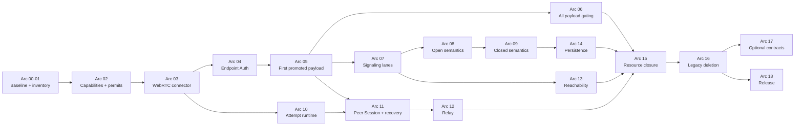

# MyOwnMesh existing-repository transition playbook

Status: stepped execution contract for transitioning the existing Rust repository to the adopted transport-independent hybrid networking architecture.

Repository target:

```text
upstream source:  mrjeeves/MyOwnMesh
architecture-owned fork: nathanfraske/MyOwnMeshSecurityReview
inspected upstream main: 9b5b4862d21ddbb92e9ff4fbbade47b41fe6fa75
inspected fork main:     28c9e27f89fdb8c2af9a9691a0fe0271befbe060
```

At inspection, upstream was two logging-focused commits ahead of the writable fork. Recheck both heads immediately before execution.

This playbook migrates the existing system. It does not authorize a clean-room rewrite.

## 1. Mission

The transition must preserve the working, field-tested network while replacing the authority model, state ownership, and cross-subsystem boundaries that conflict with the adopted architecture.

The migration formula is:

```text
wrap the working mechanism
    -> prove the target boundary
    -> redirect production callers
    -> delete the legacy authority path
```

The first product objective is a working end-to-end session on the new promotion boundary:

```text
existing signaling
    -> existing WebRTC/ICE transport work
    -> ConnectedChannelCapability
    -> channel-bound mutual Device authentication
    -> current Open or Closed policy
    -> principal-bound SessionCapability
    -> one existing application payload operation
```

Everything else builds outward from that vertical slice.

## 2. Non-negotiable constraints

1. **Transition, do not restart.** WebRTC, ICE recovery, Nostr, mDNS, STUN/TURN, native RTP media transport, daemon, GUI, installer, updater, diagnostics, and field-derived tests are assets. Fixed H.264, Opus, video, audio, and lane semantics are compatibility behavior to generalize, not basal architecture.
2. **Usability first, promotion secure.** Untrusted hints may cause bounded speculative networking work. They may not create durable authority, deliver application data, or promote a session.
3. **Transport independence, not transport removal.** The connector remains first-class and does real discovery, racing, measurement, migration, and recovery.
4. **No durable route ceremony.** Ordinary candidates, routes, current path, handoff, and reachability remain live connector/session state.
5. **One state class, one owner.** No `Arc<Mutex<GlobalState>>`, replacement engine grab bag, or global command/event enum.
6. **Open remains open.** Resource control cannot become disguised admission.
7. **Closed alone adds governance authorization.** Existing `auto_approve`, local roster mutation, or transport state cannot satisfy it.
8. **No ordinary mesh forwarding.** A relay is an explicit exact allocation carrying opaque endpoint packets.
9. **No new behavior in compatibility adapters.** Every adapter has a deletion arc.
10. **Do not invent numeric budgets.** Instrument the complete path, measure supported targets, and surface values for owner review.
11. **Own properties, not magnitudes.** This package fixes the *properties* of resource ownership. Capacity magnitudes come from a named provider supplied by the deployment or embedder, never from a document, default, or library constant. A concrete provider's arbitration algorithm is that provider's policy, not a basal architectural requirement.

## 3. Source-of-truth document set

Read in this order:

1. [`ARCHITECTURE.md`](ARCHITECTURE.md), the minimal system shape.
2. [`APPLICATION-INTEGRATION.md`](APPLICATION-INTEGRATION.md), the product-facing boundary.
3. [`IMPLEMENTATION-CONSTRAINTS-AND-INVARIANTS.md`](IMPLEMENTATION-CONSTRAINTS-AND-INVARIANTS.md), the concrete implementation contract.
4. [`FORMAL-PROOFS.md`](FORMAL-PROOFS.md), the proof obligations.
5. [`red-teams/MESH-ATTACK-VECTORS.md`](red-teams/MESH-ATTACK-VECTORS.md), source findings and adversarial gates.
6. [`ARCHITECTURE-OWNERSHIP.md`](ARCHITECTURE-OWNERSHIP.md), conflict and upstream policy.
7. [`CURRENT-TO-TARGET-MIGRATION-MATRIX.md`](CURRENT-TO-TARGET-MIGRATION-MATRIX.md), state-owner mapping.

No implementation PR may redefine a term already fixed by these documents.

## 4. Repository and branch setup

### Step 4.1. Synchronize the writable fork

1. Add or verify `upstream` points to `mrjeeves/MyOwnMesh`.
2. Fetch current upstream and record its exact commit.
3. Classify the difference from the fork using `ARCHITECTURE-OWNERSHIP.md`.
4. Fast-forward or cherry-pick all U0/U1 changes. At the inspected baseline, the two pending changes are logging-only and should be taken.
5. Run the full existing workspace and GUI checks.
6. Tag the exact pre-transition source. The final tag name is owner-selected; the tag must contain the upstream commit and date in its annotation.

### Step 4.2. Establish branch roles

Recommended roles:

```text
upstream/main
    read-only tracking reference

main
    architecture-owned, continuously buildable product branch

arc/<number>-<scope>
    one migration arc or tightly coupled vertical slice

intake/upstream-<date>-<short-sha>
    temporary branch for classifying and porting upstream work

repro/<case-id>
    isolated red-team or field-failure reproduction only
```

Branch names are workflow labels, not semantic authority.

### Step 4.3. Install the fundamental documents

Place this package at repository root, preserving the canonical names:

```text
ARCHITECTURE.md
FORMAL-PROOFS.md
IMPLEMENTATION-CONSTRAINTS-AND-INVARIANTS.md
APPLICATION-INTEGRATION.md
TRANSITION-PLAYBOOK.md
ARCHITECTURE-OWNERSHIP.md
CURRENT-TO-TARGET-MIGRATION-MATRIX.md
red-teams/MESH-ATTACK-VECTORS.md
diagrams/*
```

Do not retain a competing architecture document under another canonical name.

## 5. Migration operating model

### 5.1. Keep the current engine alive as a temporary supervisor

The existing per-network driver is the safest migration seam because it already serializes current events. During the transition it may:

- start and stop target nodes;
- translate legacy commands into narrow typed ports;
- translate target events back into legacy API events;
- preserve current behavior while callers migrate.

It may not gain new domain decisions. Its state must monotonically shrink.

### 5.2. Establish target nodes before crate extraction

Do not create a large new crate graph before state ownership is proven. Create narrow modules and actor/task owners inside `myownmesh-core` first:

```text
runtime/semantic
runtime/signaling
runtime/attempt
runtime/session_broker
runtime/peer_session
runtime/reachability
runtime/relay
connector
endpoint_auth
capability
resource
application_gateway
```

Extract crates only after:

- the owner has exclusive state custody;
- its ports are stable;
- legacy callers are gone;
- dependency direction is proven by tests.

### 5.3. Universal PR contract

Every migration PR must state:

```text
State class moved:
Old owner:
New sole owner:
New typed inputs:
New typed outputs:
Capability transition added or changed:
Pre-auth and post-auth resource effects:
Legacy adapter introduced:
Deletion arc for that adapter:
Production callers redirected:
Positive controls:
Negative controls:
Red-team cases:
Performance measurements:
Documentation updated:
```

A PR fails review if it adds a new `NetworkCmd`, global event, helper module, or shared mutable map without proving why the target owner cannot own the operation directly.

## 6. Target node ownership

| Node | Sole mutable state | Current sources initially feeding it | Must never own |
|---|---|---|---|
| Semantic Node | accepted durable facts, Open projection, Closed projection, durable grants/revocations, policy guards, verified durable basis | `roster.rs`, `network_state.rs`, `engine/governance.rs`, persistence | sockets, candidates, traffic keys, application queues |
| Signaling Node | carrier connections, durable anti-entropy, ephemeral-control routing, bounded carrier provenance | `engine/signaling_bridge.rs`, Nostr, mDNS, LocalBroker | roster decisions, endpoint identity, application delivery |
| Attempt Node | one attempt's candidates, speculative permits, race policy, cancellation, ephemeral correlation | `ensure_peer_session`, reconnect intents, signaling offer/answer flow | durable facts, application payload, session authority |
| Connector Worker | native connector state, a live connected channel, and optional connector-native data-plane providers | `transport/webrtc.rs`, ICE/TURN code, future relay connectors | mesh authorization, application codec or product meaning |
| Endpoint Auth Task | fresh channel-bound Device-authentication transcript | `engine/handshake.rs`, `signing.rs` | Open/Closed policy, application authorization |
| Session Broker | atomic promotion, current policy guard, principal binding, post-auth permits, capability minting | current approval/Active transition | packet loops, candidate gathering, durable governance |
| Peer Session Node | authenticated channels, traffic/replay state, session data-plane capabilities, application queues, recovery and local path selection | active peer state, heartbeat, ladder, reliable delivery, current media-flow ownership | durable fact construction, global topology authority, codec or screen/camera/audio semantics |
| Reachability Node | local signaling, candidate, channel, and session observations with local age | connection tracer, traffic recency, heartbeat, carrier diagnostics | participation or authorization |
| Relay Node | exact bounded opaque allocations and queues | `services/relay.rs`, TURN/generic relay code | endpoint keys, application parsing, fanout |
| Application Gateway | local principal, IPC connections, public handle leases, subscriptions | daemon control, `handle.rs`, GUI facade | internal SessionCapability construction, connector control |
| Runtime Supervisor | node lifecycle and configuration routing | current driver/service manager | domain state or authorization decisions |

## 7. Arc execution plan

Each arc ends with a buildable repository and a deletion or ownership reduction. Do not begin a later arc by bypassing an unfinished earlier gate.

### Arc 00. Baseline synchronization and documentation adoption

**Goal:** create a reproducible transition baseline with no semantic behavior change.

**Steps**

1. Synchronize the fork as described in Section 4.
2. Install the fundamental docs and diagrams.
3. Record workspace, GUI, package, installer, daemon, and integration test results.
4. Capture current connection traces for direct LAN, Nostr-signaled, mDNS-signaled, TURN, reconnect, network change, media, Channel, RPC, and daemon restart scenarios available in the test environment.
5. Record the current dependency graph and exact lockfile.

**Gate**

- Current behavior and packaging remain unchanged.
- Every test result names the exact commit.
- The source audit baseline in the red-team catalog is updated or accompanied by an exact delta note.

**Delete:** nothing.

### Arc 01. State and effect inventory

**Goal:** prove that every current mutable field, parser, constructor, queue, task, and external effect has one target owner.

**Steps**

1. Enumerate every field in `NetworkState`, `PeerConnection`, transport session state, signaling drivers, daemon client registry, relay service, and governance state.
2. Map each to the migration matrix.
3. Enumerate every `NetworkCmd`, `MeshMessage`, signaling message, transport callback, public send API, persistence write, and application callback.
4. Mark every payload bypass, ordinary forwarding path, authority mutation, and unbounded queue.
5. Add a `BOUNDARY.md` to every target module as it appears, with purpose, owned state, inputs, outputs, dependencies, resources, restart behavior, and forbidden responsibilities.

**Gate**

- No mutable field or effect is unassigned.
- No field has two final owners.
- Unknown or ambiguous cases are owner decisions, not guessed assignments.

**Delete:** no code, but no unowned feature work may merge after this arc.

### Arc 02. Capability and resource spine

**Goal:** install compile-time authority transitions without changing transport behavior.

**Create private-constructor types**

```text
ConnectorCandidateCapability
ConnectedChannelCapability
AuthenticatedChannelCapability
SessionCapability
LocalPrincipalCapability
PreAuthAttemptPermit
EndpointAuthPermit
SessionPermit
RelayAllocationPermit
ApplicationQueuePermit
```

**Steps**

1. Put capabilities in target-owned modules, not a generic `types` crate.
2. Make higher-authority capabilities non-serializable and non-constructible from public IDs.
3. Add compile-fail tests for forbidden conversions.
4. Add compatibility wrappers that carry legacy objects internally but expose the new capability types to new code.
5. Instrument current allocations by resource family without enforcing unmeasured values yet.

**Gate**

- No public constructor creates `SessionCapability`.
- A connected channel cannot be passed to an application send API.
- Public peer, route, client, request, and session labels cannot construct internal capabilities.
- Instrumentation reports item count, bytes, tasks, and lifetime by resource family.

**Delete:** any newly discovered direct constructor that has no production requirement.

### Arc 03. Wrap WebRTC as the first Connector Worker

**Goal:** preserve actual networking work while removing transport authority.

**Steps**

1. Define the narrow connector contract:

```text
start(intent, hints, permits)
receive_typed_control(...)
observe(...)
cancel(...)
    -> ConnectorCandidateEvent | ConnectedChannelCapability | Failure
```

The first WebRTC implementation uses this ownership relationship:

```text
one connection attempt
    -> multiple connector candidates

one WebRTC connector candidate
    -> one RTCPeerConnection and ICE agent
    -> multiple internal ICE candidates and candidate pairs

DataChannelOpen
    -> working ConnectedChannelCapability
    -> not authenticated session authority
```

2. Wrap `transport/webrtc.rs` without rewriting ICE, DTLS, TURN, native RTP track machinery, or the recovery ladder.
3. Split its public target boundary into the connected-channel connector and an optional WebRTC real-time flow provider. The initial implementation may remain in one source file, but the types and ownership must already be separate.
4. Route existing offer/answer/candidate flow through the connector wrapper.
5. Correlate callbacks through local attempt/candidate capabilities, not peer strings or durable route IDs.
6. Keep `MediaLaneOpen`, `MediaLaneClose`, H.264, and Opus behavior behind a compatibility adapter until Arc 06A.
7. Keep the legacy driver as caller through a compatibility adapter.

**Gate**

- Existing direct and TURN connections still establish.
- Connector output proves only a working connected channel.
- No application callback is reachable from the connector.
- Late callbacks for a dropped capability are ignored and cleaned up.

**Delete:** any transport-to-application callback made redundant by the wrapper.

### Arc 04. Extract Endpoint Auth

**Goal:** make exact Device authentication over the channel a standalone transition.

**Steps**

1. Move the channel-bound Ed25519 exchange from `engine/handshake.rs` into `endpoint_auth`.
2. Bind the transcript to exact MeshContext, local Device ID, remote Device ID, ordered roles, fresh contributions, and the connected channel's binding/exporter.
3. Return `AuthenticatedChannelCapability` on success.
4. Keep Open/Closed policy outside the authentication task.
5. Fail closed when a connector cannot provide the selected channel binding.

**Gate**

- Signaling MITM cannot relay authentication across two terminated transport legs.
- Authentication success does not expose application data.
- Replaying an old transcript cannot authenticate a different channel.
- The existing DTLS binding positive and negative tests continue to pass.

**Delete:** cryptographic identity decisions from the legacy approval state machine.

### Arc 05. First Session Broker vertical slice

**Goal:** prove the new architecture end to end with one application operation.

**Steps**

1. Add a minimal Session Broker.
2. Feed it `AuthenticatedChannelCapability` from Arc 04.
3. Use a temporary policy adapter over current roster/governance state.
4. Bind one authenticated local principal.
5. Reserve post-auth session resources.
6. Mint a fresh non-serializable `SessionCapability`.
7. Route one typed `Channel<T>` operation through the new Peer Session shell.
8. Ensure the receiver delivers only after the same promotion boundary.

**Gate**

- Connected but unauthenticated channel: no payload.
- Authenticated but policy-denied channel: no payload.
- Authenticated and policy-allowed channel: positive-control payload succeeds.
- Restart invalidates the capability.
- Direct and TURN carriers produce the same remote Device identity.

**Delete:** the migrated Channel operation's old send and receive bypasses.

### Arc 06. Complete application payload gating

**Goal:** place all application data behind live SessionCapability.

**Migrate in bounded groups**

1. directed Channel send and receive;
2. broadcast as explicit bounded application fanout over independent sessions;
3. unary and streaming RPC;
4. reliable delivery;
5. capabilities exchange that is truly application-level;
6. video and audio send;
7. video and audio receive and IPC delivery;
8. daemon subscriptions and callbacks.

**Gate for every group**

- no serialization or queue insertion before the live handle guard;
- no inbound application state mutation before promotion;
- stale, foreign-principal, closed, or policy-invalidated handles fail;
- positive control is preserved;
- queue and task instrumentation exists.

**Delete:** peer-string, socket, route, `ClientId`, and transport-object authority paths for the migrated group.

### Arc 06A. Generalize Media Lanes into an optional real-time flow extension

**Goal:** preserve the field-tested WebRTC RTP path while removing codec and product semantics from basal MyOwnMesh.

**Steps**

1. Introduce connector/session-owned `RealtimeFlowProvider`, `RealtimeFlowHandle`, encoded-unit, and observation types with private constructors.
2. Move WebRTC RTP, RTCP, transceiver creation, track drain/revive behavior, m-line handling, and transport-specific measurements behind the WebRTC real-time flow provider.
3. Remove `LaneKind::Video` and `LaneKind::Audio` from the target core boundary. Move H.264, Opus, screen, camera, microphone, and product meanings to the application or a compatibility profile.
4. Map legacy `MediaLaneOpen`, `MediaLaneClose`, `VideoSample`, `AudioSample`, and current IPC operations onto the new provider without changing their observable behavior.
5. Require a live `SessionCapability` for application flow open, write, read, and close. Pre-authentication native tracks may exist only under the bounded quarantine rule.
6. Preserve native zero-copy or low-copy transport paths where measured. Do not force real-time units through the reliable JSON Channel/RPC path.
7. Allow connectors that do not implement real-time flows to report `UnsupportedDataPlane` while remaining fully conforming.
8. Migrate AllMyStuff and other consumers to application-owned flow descriptions, then delete the legacy media-lane compatibility surface.

**Gate**

- data-only sessions work without any media-track provisioning requirement;
- the core has no fixed codec, media purpose, or lane-count authority;
- WebRTC real-time behavior, latency, loss handling, and reopen behavior remain owner-acceptable under measurement;
- no pre-promotion encoded unit reaches an application or leaves as authenticated application data;
- an alternate connector without native media support still establishes ordinary sessions;
- compatibility code contains no new behavior and has an explicit deletion target.

**Delete:** direct core ownership of `LaneKind::Video`, `LaneKind::Audio`, fixed codec semantics, and legacy lane APIs after downstream migration.

### Arc 07. Split signaling into typed lanes

**Goal:** retain production signaling while separating durable semantics, ephemeral transport control, and application data.

**Steps**

1. Add an immutable outer lane discriminator before domain parsing.
2. Define separate closed unions for:
   - durable semantic exchange;
   - ephemeral transport control;
   - endpoint/session control where needed;
   - application frames on promoted channels.
3. Adapt Nostr, mDNS, LocalBroker, and self-hosted signaling to the lane contract.
4. Preserve bounded carrier provenance after semantic deduplication.
5. Route offer/answer/candidates to Attempt Nodes, not durable storage.
6. Route durable facts only to the Semantic Node.

**Gate**

- candidate exchange is not durable history;
- durable facts remain idempotent and transport-independent;
- neither signaling lane accepts ordinary application payload;
- carrier disconnect cannot synthesize durable leave or close a newer session;
- mixed-lane parser confusion tests fail safely.

**Delete:** signaling bridge paths that erase provenance or route all messages through one semantic handler.

### Arc 08. Open Semantic Node

**Goal:** replace current Open roster authority with permissionless durable semantics.

**Steps**

1. Implement canonical durable Open participation facts and pure derivation.
2. Add durable store and verified basis support needed for Open.
3. Implement bounded ingress, validation, conflict behavior, retention, and `Unknown` on proof loss.
4. Expose revocable local policy guards to the Session Broker and Peer Session Nodes.
5. Run current Open roster and new Open projection in differential mode for observation only.
6. Switch new-mode session admission to the new Open projector.

**Gate**

- any authentic Device may self-participate without sponsor or pair grant;
- identity rotation does not bypass global resource accounting;
- absence, signaling loss, and reachability failure do not synthesize withdrawal;
- ambiguous same-cell durable facts fail closed only for that cell;
- bounded speculative transport may proceed before projection completes, but promotion cannot.

**Delete:** Open authority from `roster.rs`, `auto_approve`, topology, and application policy.

### Arc 09. Closed Semantic Node and explicit state migration

**Goal:** replace legacy Closed governance without centralizing authority or silently reinterpreting old state.

**Steps**

1. Owner-select and test-vector the Closed governance proof profile.
2. Implement the pure Closed projector and conflict rule.
3. Bind every authority-bearing field into canonical signed content.
4. Expose current policy guards and invalidation.
5. Build an explicit legacy migration tool:
   - inspect legacy state;
   - produce a proposed new Closed context/genesis;
   - require owner/admin confirmation under the selected local-principal mechanism;
   - preserve source evidence separately;
   - never reinterpret old signatures as new proof.
6. Switch new-mode Closed sessions to the new projector.

**Gate**

- a fresh valid key is not Closed-authorized;
- `auto_approve` cannot add Closed authority;
- local control clients need authenticated administration capability;
- concurrent governance conflict follows only the selected rule;
- Open records carry no authority into Closed;
- relevant removal invalidates policy guards before further protected operations.

**Delete:** legacy Closed authority, legacy split adoption, and legacy role/topology authority after migration support has completed.

### Arc 10. Attempt Nodes and candidate racing

**Goal:** replace per-network candidate orchestration with one bounded owner per attempt.

**Steps**

1. Create one Attempt Node for each outbound request or accepted inbound attempt.
2. Move speculative permits, candidates, offer/answer state, cancellation, and connector-worker ownership into it.
3. Race eligible direct, ICE, TURN, generic relay, and Closed member relay candidates according to local policy.
4. Do not require direct exhaustion before relay attempt.
5. Run policy lookup and transport establishment concurrently where safe; require policy only at promotion.
6. Emit precise failures: no signaling, no viable transport, endpoint auth failure, policy failure, resource limit.

**Gate**

- no candidate object survives its attempt capability;
- one failed or malicious origin stays within pre-auth budgets;
- first working channel proceeds immediately to Endpoint Auth;
- no durable path or route identity is created;
- time-to-candidate, time-to-channel, time-to-auth, and time-to-promotion are measured separately.

**Delete:** reconnect/candidate state from `NetworkState` and global command handling.

### Arc 11. Peer Session Node, recovery, and handoff

**Goal:** make one node own all post-promotion transport and application-session state for an endpoint relationship.

**Steps**

1. Move authenticated channels, traffic keys, replay state, app queues, and current local send selection into Peer Session Node.
2. Relocate heartbeat, inbound-recency confirmation, network-change recovery, ICE restart, rebuild ladder, and media ownership.
3. Permit multiple authenticated channels temporarily.
4. Attempt replacement channels while the current channel remains active.
5. Attach a replacement only after fresh endpoint authentication or an owner-selected current-session channel confirmation construction.
6. Select outbound channel locally; no global switch or relay-to-relay handoff.
7. Close or retain the old channel according to local measured policy.

**Gate**

- old-channel replay does not authenticate on replacement channel;
- a relay or signaling sender cannot issue a switch command;
- dropping the old path may influence failover timing but cannot authorize the replacement;
- current field-tested recovery positive controls remain;
- no persistent PathID, path generation, or current route exists.

**Delete:** active peer-session state from the legacy per-network driver.

### Arc 12. Exact relay profiles and ordinary-routing deletion

**Goal:** retain relay usability without ordinary member forwarding.

**Steps**

1. Implement a generic exact opaque relay allocation profile.
2. Implement Closed member relay as a visible Device B capability where selected.
3. Bind each allocation to exact endpoints, context, attempt/channel, finite resources, and exact destination.
4. Forward endpoint-authentication and encrypted endpoint packets only.
5. Keep relay, signaling, and endpoint roles semantically distinct even when co-located.
6. Port any useful current relay networking mechanism and tests.
7. Delete legacy routed send and plaintext/fanout relay behavior.

**Gate**

- B cannot read or author accepted A-C application payload;
- no arbitrary destination or fanout;
- no anonymous relay attestation;
- no relay-to-relay handoff dependency;
- every allocation, retained byte, queued value, and retry owns a finite lease, while provider bandwidth and optional cost policy remain explicit;
- direct and relay paths expose the same endpoint identity.

**Delete:** `engine/routing.rs` production path and nonconforming `services/relay.rs` behavior.

### Arc 13. Reachability and diagnostics

**Goal:** expose useful network state without making it authority.

**Steps**

1. Create the Reachability Node.
2. Feed it signaling responsiveness, candidate status, connected-channel state, endpoint-authenticated channel state, active session state, latency, loss, and local observation time.
3. Preserve field-tested inbound-traffic confirmation as the strongest current path evidence available to that profile.
4. Expose a vector rather than one authoritative `Online` bit.
5. Keep carrier provenance bounded and diagnostic only.

**Gate**

- missing observations never produce withdrawal/removal;
- remote or carrier timestamps do not supply local freshness;
- applications can distinguish roster, signaling, candidate, authenticated-channel, and session states;
- connector recovery continues to use reliable live evidence.

**Delete:** any existing status field that conflates durable participation with current transport.

### Arc 14. Durable persistence, compaction, and uniform store opening

**Goal:** make durable semantics reopenable without restoring live network authority.

**Steps**

1. Persist only durable semantic state, verified basis material, and exact durable pending-effect state.
2. On every start, use one `OpenStore` path, regardless of storage history.
3. Reconstruct no sockets, candidates, channels, traffic keys, replay windows, observations, reservations, or session handles.
4. Implement independently reopenable compaction bases only after extension-equivalence tests exist.
5. Ensure facts reference facts; continuation evidence and bases do not become authors or semantic facts.

**Gate**

- opening the same store reproduces durable state only;
- no historical effect is replayed merely because state was reopened;
- predecessor-base storage is removable only when current base verification and ordinary continuation remain self-contained;
- unresolved conflict and live-dependent durable evidence are preserved;
- whole-witness rollback limits are documented honestly.

**Delete:** any persistence path that serializes live session or route authority.

### Arc 15. Resource closure

**Goal:** replace instrumentation-only accounting and unleased work with property-level resource ownership: every protected allocation, retained value, task, queue entry, native object, and scheduled work unit is dominated by a live finite lease from a named provider.

**Provider boundary**

This arc fixes ownership properties. It does not fix which provider supplies capacity, and it writes no capacity value.

```text
production
    host-backed provider   capacity derived from actual host or OS facts
    isolated provider      capacity bounded by an enforced container, cgroup, or appliance boundary
    injected provider      capacity supplied by the embedding process owner

tests and explicit local envelopes
    deterministic finite provider over one explicit finite grant

optional local ceilings
    explicitly optional, owner-selected, never a basal limit
```

The provider port is an injection point, not a fixed implementation. Any provider that satisfies the property gate below conforms. A provider that cannot name where its capacity came from does not conform.

The arbitration order and rotation rule of whichever provider is installed are that provider's concrete policy. They are verified against that provider, they are not basal architecture, and replacing a conforming provider with another conforming provider does not reopen the property gate.

**Steps**

1. Define the resource provider port, finite claim vector, exact lease, typed pressure results, and explicit residual classification. Keep the port injectable so a host-backed, isolated, injected, or deterministic finite provider can be installed without changing owners.
2. Make every protected allocation, retained value, task, queue entry, native object, and scheduled work unit hold a live lease.
3. Issue accounting and attribution child scopes without multiplying the process grant.
4. Replace unleased channels, maps, task spawns, queues, retries, and storage with typed admission and pressure results.
5. Keep one process grant shared and work-conserving, with no weights, quotas, reserved shares, or partitions, and reserve only a selected demand's exact charge so surplus stays borrowable. State the installed provider's arbitration as concrete provider policy: the current deterministic finite provider represents one exact move-only pending demand per scope, selects `Cleanup > Admitted > Speculative`, and rotates equal-class selection across process-local scope identities after each resolved demand. Document that order and rotation as this provider's policy, not as a basal limit on conforming providers.
6. Keep protocol bounds, provider structural limits, runtime availability, and optional local ceilings distinct.
7. Let a provider request retirement only from the exact owner of a lease whose owner contract declares it reclaimable; the current deterministic finite provider treats `Speculative` leases as that reclaimable class, which is provider policy rather than a basal requirement. Keep disposition with owner Drop after cleanup or explicit failed-cleanup retention. Add no timer and claim no guarantee against nonreclaimable admitted pressure, ignored retirement, or failed cleanup.
8. Test the property gate and the provider policy separately. Property tests cover identity rotation, many-source pressure, unequal claim sizes, exact release, conservation under concurrent charges, child-scope borrowing, cooperative retirement, ignored retirement, failed-cleanup retention, pre-reserved cleanup under a full grant, optional ceilings including the all-absent case, slow work, and storage-backed work. Provider-policy tests cover move-only pending demand, authority ordering, equal-class rotation, victim-set proof, and arbitration determinism against the installed provider.
9. Measure performance, provider cost, scheduling, regression, and opaque residuals without deriving universal object counts.
10. Require the deployment or embedder to name the installed provider and the origin of its capacity. Ship no default grant, no library-supplied numeric value, and no invented ceiling.

**Gate: property-level resource ownership**

This is the transition gate. It is stated as properties of ownership, and any conforming provider may satisfy it.

- **Domination.** Every named protected allocation and scheduled operation is dominated by a live finite lease, and every lease names its provider, its resource dimension, and its owner.
- **Conservation.** Exact lease release restores exactly that capacity and nothing else; concurrently held charges never exceed the grant in any dimension.
- **No capacity minting.** Creating, cloning, or nesting a scope creates no capacity, and no accounting, attribution, or observation path can mint any.
- **Impossibility.** A composite claim that does not fit the grant is refused; one large claim may cost more than many small claims, so no object count implies admissibility.
- **Pressure is not authorization.** Refusal names a resource dimension rather than an object count; resource refusal is never an Open or Closed authorization result, and Open overload is reported as resource pressure, never as unauthorized identity.
- **Non-interchangeable permits.** Pre-auth and post-auth permits cannot substitute for each other.
- **Non-multipliable service weight.** A scheduling weight, quantum, or share is connector-local ordering only; it reserves no provider capacity, guarantees no cross-scope admission, and multiplying it multiplies no grant.
- **Cleanup ownership.** Cleanup capacity that must be available under every condition is reserved before allocation, so cleanup proceeds from its pre-reserved claim even when the grant is full; disposition remains owner Drop after cleanup or explicit failed-cleanup retention, and no provider releases or invalidates an owner's lease.
- **Explicit isolation.** Outside a selected pending charge, unused capacity is borrowable unless an explicit local isolation policy forbids it; isolation is opt-in and named, never implied.
- **Exact reservation.** A selected pending demand reserves only its exact charge; surplus remains borrowable, including surplus in an overlapping dimension.
- **No basal cardinality.** No `unlimited` sentinel, default grant, hidden default cardinality, or basal maximum Mesh, peer, attempt, session, or flow count exists; the process grant carries no weights, quotas, reserved shares, or partitions.
- **Time is not resource truth.** No timer creates, releases, or reclaims capacity, and no valid slow lease expires by elapsed time alone.
- **Honest limits.** No admission guarantee is claimed against nonreclaimable admitted pressure, ignored retirement, or failed cleanup; every dimension the implementation does not charge is a named residual, not silence.
- **Optional ceilings stay optional.** Every local ceiling is owner-selected and separable; removing all of them leaves a conforming system, and no ceiling is reported as a protocol bound or a provider structural limit.
- Normal connection and media performance remains owner-acceptable under measured workloads.

**Gate: concrete deterministic-provider policy**

These are properties of the installed provider, verified against that provider. They are not basal architecture. Installing a different conforming provider changes what is verified here and does not reopen the property gate above.

- one move-only pending demand exists per scope;
- arbitration selects `Cleanup > Admitted > Speculative`, with equal-class rotation across process-local scope identities;
- reclaim requests are published only after the provider proves the selected victim set can satisfy the deficit;
- the provider requests retirement only from exact reclaimable Speculative owners and never releases their claims;
- arbitration is deterministic: identical claim sequences over identical grants produce identical admission outcomes, with no clock, entropy, or host probe in the decision;
- the deterministic finite provider derives its capacity from one explicit finite grant and computes none of it;
- a host-backed or isolated production provider, when introduced, restates this section against its own arbitration and capacity derivation.

**Delete:** unleased production work, legacy ad hoc caps presented as basal semantic limits, and any documented arbitration rule presented as a basal requirement on all providers.

### Arc 16. Legacy engine and compatibility removal

**Goal:** finish the ownership transition.

**Steps**

1. Redirect all remaining callers to target nodes.
2. Remove every compatibility adapter whose deletion gate has passed.
3. Delete `NetworkState` fields and `NetworkCmd` variants as their owners leave.
4. Delete the legacy driver when it owns only lifecycle that the Runtime Supervisor already owns.
5. Split stable target modules into crates only where the dependency boundary now has independent value.
6. Search for old authority terms, route paths, direct send APIs, and raw signaling constructors.

**Gate**

- no mutable state has two owners;
- no global engine/state grab bag remains;
- no ordinary forwarding path exists;
- every app operation requires a live SessionCapability;
- every Closed operation reaches the new projector and local-principal guard;
- all architecture and red-team gates pass.

**Delete:** all legacy semantic and compatibility code.

### Arc 17. Optional causal-contract/application domains

**Goal:** add generalized ledger/contract power without putting it back in the networking critical path.

This arc begins only after Arc 16 gates pass.

**Steps**

1. Implement optional typed application contract domains over authenticated sessions or selected durable scopes.
2. Keep arbitrary opaque fact bodies prohibited.
3. Confine optional consensus, ordering, replicated execution, or blockchain-like behavior to exact application domains.
4. Prove no optional domain delays or authorizes ordinary candidate work, endpoint authentication, channel promotion, or unrelated sessions.

**Gate**

- disabling the optional domain leaves ordinary networking unchanged;
- application contracts cannot become core mesh authority without an explicit reviewed bridge;
- application payload remains outside core signaling.

### Arc 18. Release and migration rollout

**Goal:** deploy without silently mixing incompatible authority models.

**Steps**

1. Owner-select the final new protocol/profile identifier.
2. Negotiate or detect legacy versus new mode explicitly.
3. Never treat a legacy peer as satisfying new Closed admission or SessionCapability requirements.
4. Provide explicit identity and network-context migration tooling.
5. Stage release through test, internal, mixed-version, and production cohorts.
6. Retain rollback to the pre-transition release only while it does not write state the older release will misinterpret.
7. Remove compatibility mode on an owner-approved gate, not an assumed date.

**Gate**

- no silent downgrade;
- mixed-version behavior is typed and documented;
- new state is not interpreted by old authority code;
- production observability distinguishes negotiation, transport, authentication, policy, and promotion failures;
- installer, daemon, GUI, updater, and supported platforms remain functional.

## 8. Critical-path and parallel work



The earliest usable target milestone is Arc 05. Open/Closed semantic replacement and full modular extraction continue after the promotion boundary is already running in the existing product.

## 9. First pull-request queue

The first PRs should be deliberately small:

1. **`docs: adopt hybrid architecture and transition ownership`**  
   Add this package, baseline record, no product behavior change.
2. **`core: introduce private channel and session capability spine`**  
   Types, compile-fail tests, no production authority change.
3. **`transport: wrap existing webrtc session as connector capability`**  
   Preserve transport behavior, no app dispatch.
4. **`auth: extract channel-bound device authentication`**  
   Produce `AuthenticatedChannelCapability`.
5. **`session: promote one authenticated channel into one capability`**  
   Temporary policy adapter, one typed Channel positive control.
6. **`session: gate directed channel and rpc operations`**  
   Remove their old bypasses.
7. **`session: gate media send, receive, and ipc delivery`**  
   Preserve pre-auth bounded transport setup; block application exposure.
8. **`transport: generalize media lanes into optional realtime flows`**  
   Keep WebRTC RTP performance; move H.264, Opus, video/audio meaning, and fixed lane policy out of the basal core.
9. **`signaling: classify durable and ephemeral lanes before parsing`**  
   Preserve Nostr/mDNS/LocalBroker behavior.
10. **`semantics: add open participation projector and policy guards`**  
   Differential observation, then new-mode admission.
11. **`attempt: own speculative candidates and racing per attempt`**  
    Shrink `NetworkState` and driver ownership.

Do not start by rewriting governance, compaction, or optional contracts. The first proof must be that the existing repository can create a useful session through the new promotion boundary.

## 10. Test and evidence program

### 10.1 Compile-time boundaries

Require compile-fail or visibility tests proving:

- application code cannot construct signaling records or connector control;
- connector code cannot mint SessionCapability;
- signaling code cannot deliver application data;
- relay code cannot access endpoint traffic keys;
- public IDs cannot reconstruct local capabilities;
- durable semantic code imports no transport runtime.

### 10.2 Pure semantic tests

Cover canonical encoding, signatures, exact context, Open self-participation, Closed proof confinement, independent/joinable/exclusive concurrency, compaction equivalence, and store-opening non-revival.

### 10.3 Deterministic networking simulation

Build fakes for signaling carriers, connectors, connected channels, relay, time, entropy, resources, and fault injection. Exercise every callback order, duplicate, cancellation, crash boundary, and policy invalidation relevant to promotion and recovery.

### 10.4 Real integration matrix

Preserve and expand current cross-platform and field scenarios:

- direct LAN;
- Nostr signaling;
- mDNS signaling;
- TURN;
- network change;
- sleep/wake;
- stale ICE state while traffic flows;
- apparently connected transport with no traffic;
- media;
- daemon and GUI IPC;
- process restart;
- mixed-version behavior where supported.

### 10.5 Performance evidence

Measure at minimum:

```text
time to first hint
time to first candidate
time to first connected channel
time to endpoint authentication
time to policy result
time to promoted session
time to first application byte
recovery time by failure class
pre-auth bytes, tasks, sockets, and CPU
post-auth queue and media costs
cleanup time and retained state
```

Do not collapse these into one connection time, because the architecture separates them intentionally.

## 11. Upstream intake during transition

1. Fetch upstream on a regular owner-selected cadence and before every release.
2. Create an `intake/` branch at the exact upstream commit.
3. Classify each commit U0-U5.
4. Merge U0 and proven U1 changes.
5. For U2, port the failure reproduction, test, and mechanism into the target owner. Do not merge the legacy state owner.
6. Reject U3 behavior with a written invariant reference.
7. Send U4 to owner review with measured tradeoffs.
8. Update the migration matrix when a path becomes architecture-owned.

A field fix is not lost because its old module is rejected. The bug reproduction and mechanism are preserved in the correct owner.

## 12. Stop conditions

Pause the arc and surface an owner decision when:

- a claimed protocol or provider limit has not been proven;
- a proposed optional local ceiling lacks owner review;
- the selected Closed proof profile is still undefined;
- a competing design presents a real usability/security tradeoff;
- migration would silently reinterpret existing durable authority;
- a current field behavior cannot be reproduced or explained;
- a state class cannot be assigned one owner without changing product semantics;
- a compatibility adapter would need permanent product behavior;
- a supported platform or required transport profile regresses;
- the proposed change would reintroduce a durable route, global current path, or transport-removed design.

## 13. Definition of architecture-complete

The transition is complete when all of the following are true:

1. the connector attempts and races viable transport paths under bounded speculative resources;
2. a working channel is not application authority;
3. exact mutual Device authentication is bound to the working channel;
4. Open or Closed policy and local-principal admission gate promotion;
5. every application send, receive, callback, optional real-time flow operation, and recovery action uses a live SessionCapability;
6. signaling and application payload types are disjoint;
7. durable semantics are transport-independent, while transport remains first-class;
8. Open has no hidden sponsor or pair-permission gate;
9. Closed alone carries governance authorization;
10. ordinary mesh-member payload forwarding is absent;
11. relays use exact bounded opaque allocations;
12. handoff is endpoint-driven, with no route ledger or relay-to-relay requirement;
13. reachability is useful local evidence, not authority;
14. store opening restores durable state but no live networking capability;
15. every protected resource family has a live lease, a named provider, typed pressure behavior, and an explicit exactness or residual classification, with the Arc 15 property gate satisfied and no arbitration algorithm required of a conforming provider;
16. every mutable state class has one owner;
17. the legacy driver, `NetworkState` grab bag, authority bypasses, and compatibility adapters are deleted;
18. the full conformance and red-team suite passes on built artifacts;
19. supported deployment, GUI, daemon, installer, updater, and platform behavior remains accepted by the owner.

## 14. Owner decisions that remain explicit

The playbook does not invent:

- the final protocol/profile identifier;
- the Closed governance proof and recovery rule;
- local-principal authentication per platform;
- the installed resource provider, the origin of its capacity, and its arbitration policy;
- whether the optional local ceiling set is absent or enabled, and every value in it when enabled;
- optional local resource, queue, retry, timeout, cache, cost, isolation, and bandwidth policy values;
- required restrictive-network connector profiles;
- mixed-version compatibility duration;
- application data-operation set and optional connector-native real-time flow contract;
- performance regression tolerances;
- release cohort and rollback policy.

Each optional policy is surfaced with measurements and concrete alternatives for owner review. Measurements do not define basal product cardinality.
